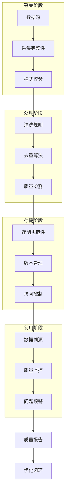
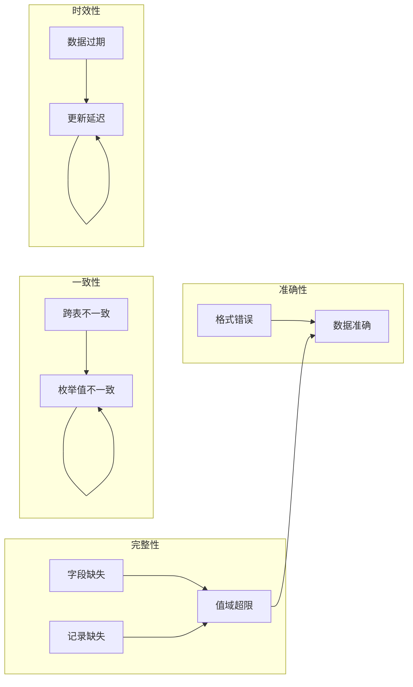

# 图10.4：数据质量管理框架

## 全链路数据质量保障

```mermaid
flowchart TD
    subgraph 采集阶段
        A[数据源] --> B[采集完整性]
        B --> C[格式校验]
    end
    
    subgraph 处理阶段
        C --> D[清洗规则]
        D --> E[去重算法]
        E --> F[质量检测]
    end
    
    subgraph 存储阶段
        F --> G[存储规范性]
        G --> H[版本管理]
        H --> I[访问控制]
    end
    
    subgraph 使用阶段
        I --> J[数据溯源]
        J --> K[质量监控]
        K --> L[问题预警]
    end
    
    L --> M[质量报告]
    M --> N[优化闭环]
```

## 质量检查项

```mermaid
flowchart LR
    subgraph 完整性
        A[字段缺失] --> D[数据完整]
        B[记录缺失] --> D
    end
    
    subgraph 准确性
        C[格式错误] --> E[数据准确]
        D[值域超限] --> E
    end
    
    subgraph 一致性
        F[跨表不一致] --> G[数据一致]
        G[枚举值不一致] --> G
    end
    
    subgraph 时效性
        H[数据过期] --> I[数据时效]
        I[更新延迟] --> I
    end
```
