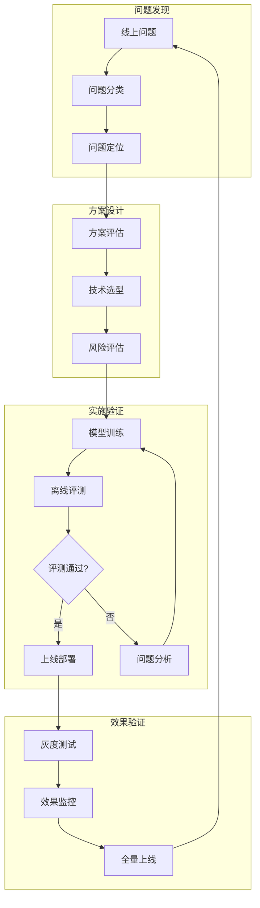
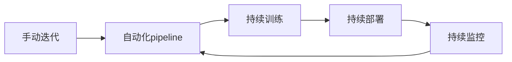

# 图10.5：迭代优化流程

## 模型迭代闭环

```mermaid
flowchart TD
    subgraph 问题发现
        A[线上问题] --> B[问题分类]
        B --> C[问题定位]
    end
    
    subgraph 方案设计
        C --> D[方案评估]
        D --> E[技术选型]
        E --> F[风险评估]
    end
    
    subgraph 实施验证
        F --> G[模型训练]
        G --> H[离线评测]
        H --> I{评测通过?}
        I -->|是| J[上线部署]
        I -->|否| K[问题分析]
        K --> G
    end
    
    subgraph 效果验证
        J --> L[灰度测试]
        L --> M[效果监控]
        M --> N[全量上线]
        N --> A
    end
```

## 迭代效率优化

```mermaid
flowchart LR
    A[手动迭代] --> B[自动化pipeline]
    B --> C[持续训练]
    C --> D[持续部署]
    D --> E[持续监控]
    E --> B
```
