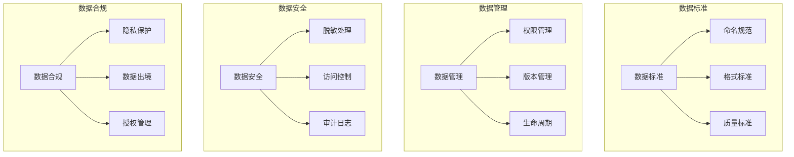
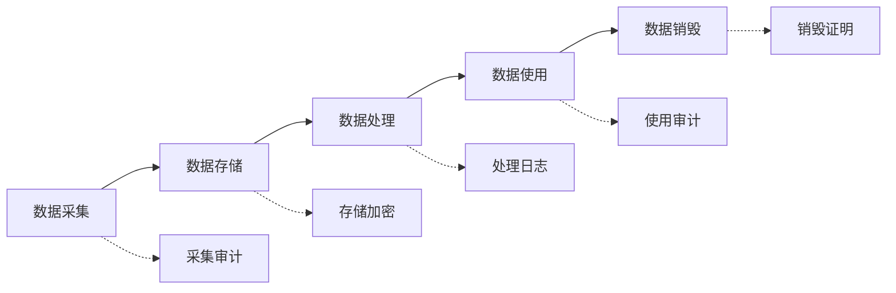

# 图10.6：数据治理体系

## 数据治理框架

```mermaid
flowchart TD
    subgraph 数据标准
        A[数据标准] --> A1[命名规范]
        A --> A2[格式标准]
        A --> A3[质量标准]
    end
    
    subgraph 数据管理
        B[数据管理] --> B1[权限管理]
        B --> B2[版本管理]
        B --> B3[生命周期]
    end
    
    subgraph 数据安全
        C[数据安全] --> C1[脱敏处理]
        C --> C2[访问控制]
        C --> C3[审计日志]
    end
    
    subgraph 数据合规
        D[数据合规] --> D1[隐私保护]
        D --> D2[数据出境]
        D --> D3[授权管理]
    end
```

## 数据流转管控

```mermaid
flowchart LR
    A[数据采集] --> B[数据存储]
    B --> C[数据处理]
    C --> D[数据使用]
    D --> E[数据销毁]
    
    A -.-> A1[采集审计]
    B -.-> B1[存储加密]
    C -.-> C1[处理日志]
    D -.-> D1[使用审计]
    E -.-> E1[销毁证明]
```
