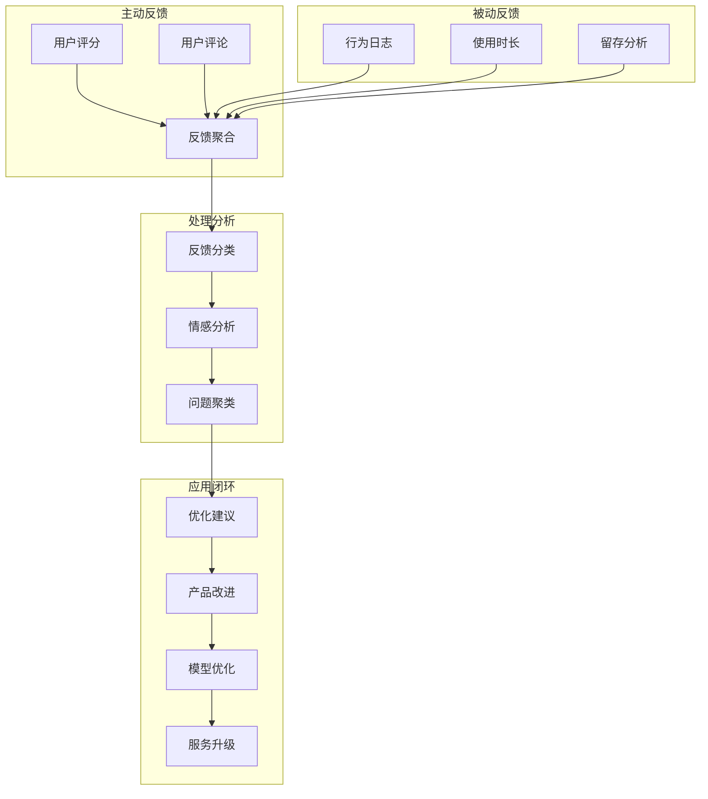
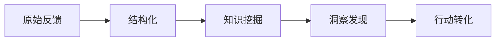

# 图10.7：用户反馈收集与处理

## 反馈收集体系

```mermaid
flowchart TD
    subgraph 主动反馈
        A[用户评分] --> C[反馈聚合]
        B[用户评论] --> C
    end
    
    subgraph 被动反馈
        D[行为日志] --> C
        E[使用时长] --> C
        F[留存分析] --> C
    end
    
    subgraph 处理分析
        C --> G[反馈分类]
        G --> H[情感分析]
        H --> I[问题聚类]
    end
    
    subgraph 应用闭环
        I --> J[优化建议]
        J --> K[产品改进]
        K --> L[模型优化]
        L --> M[服务升级]
    end
```

## 反馈价值挖掘

```mermaid
flowchart LR
    A[原始反馈] --> B[结构化]
    B --> C[知识挖掘]
    C --> D[洞察发现]
    D --> E[行动转化]
```
