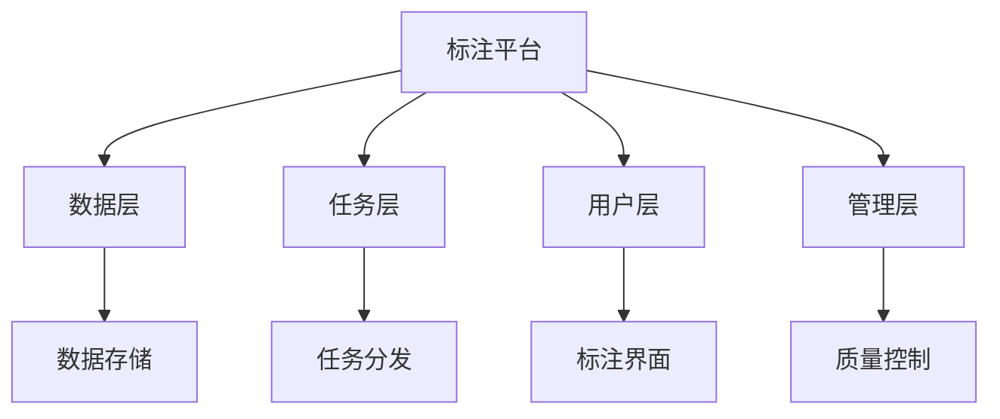

# 图10.1：标注平台架构

## 系统架构

```mermaid
flowchart TD
    A[标注平台] --> B[数据层]
    A --> C[任务层]
    A --> D[用户层]
    A --> E[管理层]
    
    B --> B1[数据存储]
    C --> C1[任务分发]
    D --> D1[标注界面]
    E --> E1[质量控制]
```
