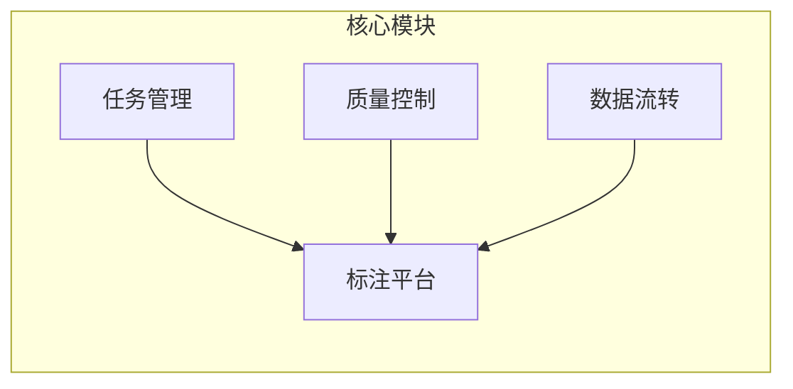
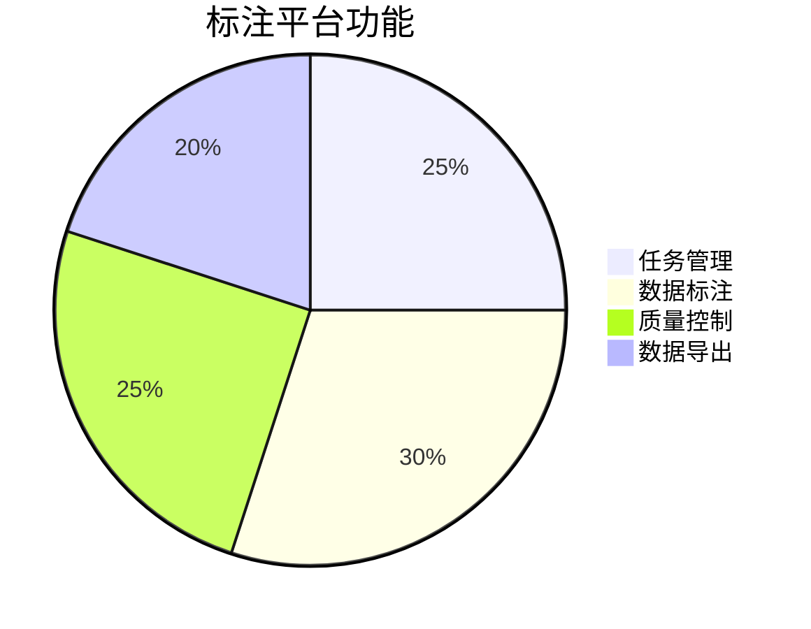

# 图10.2：平台核心组件

## 组件设计

```mermaid
flowchart LR
    subgraph 核心模块
        A[任务管理] --> D[标注平台]
        B[质量控制] --> D
        C[数据流转] --> D
    end
```

## 功能模块

```mermaid
pie title 标注平台功能
    "任务管理" : 25
    "数据标注" : 30
    "质量控制" : 25
    "数据导出" : 20
```
