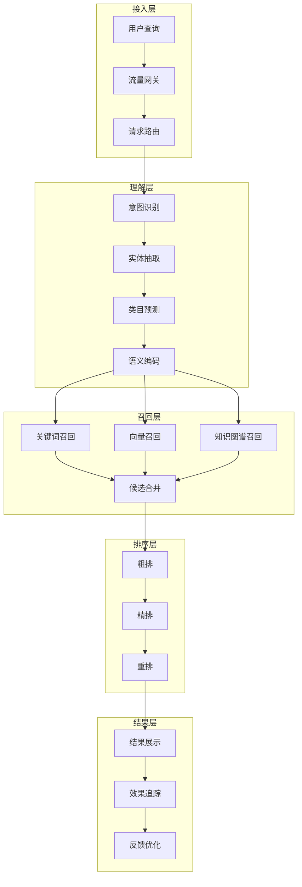

# 图11.1：电商搜索实践架构

## 端到端服务架构

本章以电商搜索为案例，展示完整的LLM服务落地实践：

## 核心模块技术选型

| 模块 | 技术选型 | 核心能力 |
|------|---------|----------|
| 语义编码 | BERT/ERNIE | 深度语义理解 |
| 向量召回 | Faiss/HNSW | 高效相似检索 |
| 知识图谱 | Neo4j | 结构化知识 |
| 模型排序 | LightGBM/DNN | 智能排序 |
