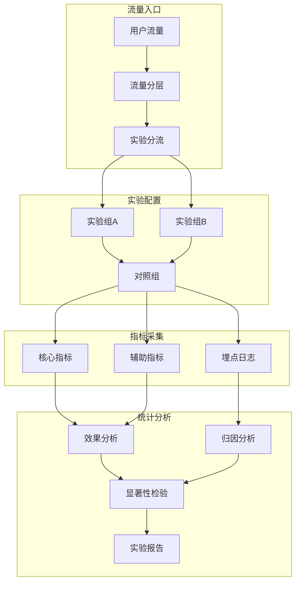
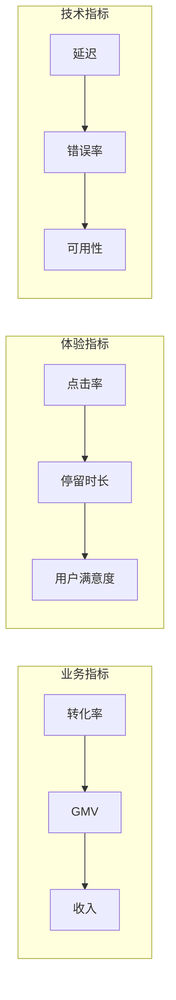

# 图11.2：A/B测试框架

## 实验配置与流量分配

```mermaid
flowchart TD
    subgraph 流量入口
        A[用户流量] --> B[流量分层]
        B --> C[实验分流]
    end
    
    subgraph 实验配置
        C --> D[实验组A]
        C --> E[实验组B]
        D --> F[对照组]
        E --> F
    end
    
    subgraph 指标采集
        F --> G[核心指标]
        F --> H[辅助指标]
        F --> I[埋点日志]
    end
    
    subgraph 统计分析
        G --> J[效果分析]
        H --> J
        I --> K[归因分析]
        J --> L[显著性检验]
        K --> L
        L --> M[实验报告]
    end
```

## 关键指标监控

```mermaid
flowchart LR
    subgraph 业务指标
        A[转化率] --> D[GMV] --> G[收入]
    end
    
    subgraph 体验指标
        B[点击率] --> E[停留时长] --> H[用户满意度]
    end
    
    subgraph 技术指标
        C[延迟] --> F[错误率] --> I[可用性]
    end
```
