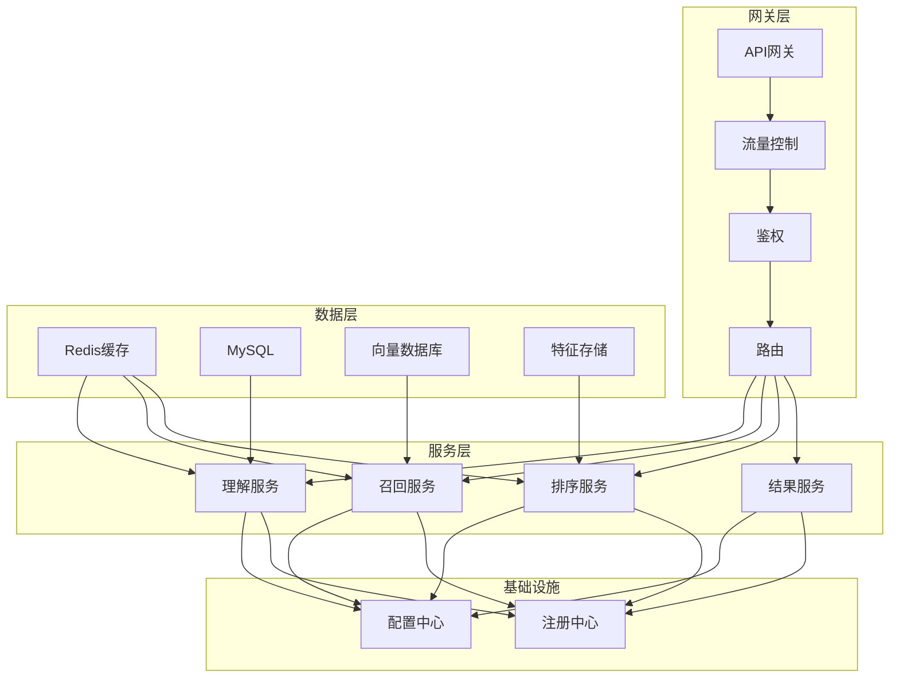
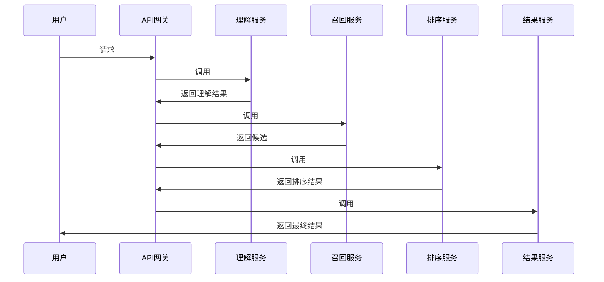

# 图11.3：微服务架构设计

## 服务组件架构

```mermaid
flowchart TD
    subgraph 网关层
        A[API网关] --> B[流量控制]
        B --> C[鉴权]
        C --> D[路由]
    end
    
    subgraph 服务层
        D --> E[理解服务]
        D --> F[召回服务]
        D --> G[排序服务]
        D --> H[结果服务]
    end
    
    subgraph 基础设施
        E --> I[配置中心]
        F --> I
        G --> I
        H --> I
        E --> J[注册中心]
        F --> J
        G --> J
        H --> J
    end
    
    subgraph 数据层
        K[Redis缓存] --> E
        K --> F
        K --> G
        L[MySQL] --> E
        M[向量数据库] --> F
        N[特征存储] --> G
    end
```

## 服务调用链路

```mermaid
sequenceDiagram
    participant User as 用户
    participant Gateway as API网关
    participant Understand as 理解服务
    participant Recall as 召回服务
    participant Rank as 排序服务
    participant Result as 结果服务
    
    User->>Gateway: 请求
    Gateway->>Understand: 调用
    Understand->>Gateway: 返回理解结果
    Gateway->>Recall: 调用
    Recall->>Gateway: 返回候选
    Gateway->>Rank: 调用
    Rank->>Gateway: 返回排序结果
    Gateway->>Result: 调用
    Result->>User: 返回最终结果
```
