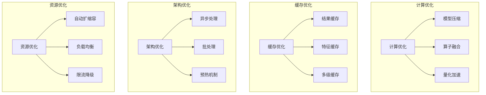
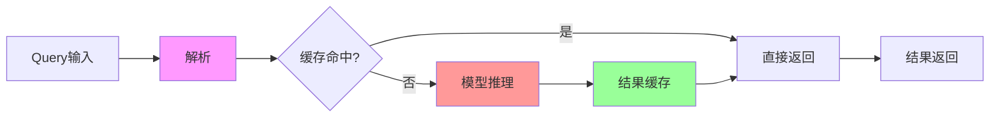

# 图11.4：性能优化策略

## 多级优化体系

```mermaid
flowchart TD
    subgraph 计算优化
        A[计算优化] --> A1[模型压缩]
        A --> A2[算子融合]
        A --> A3[量化加速]
    end
    
    subgraph 缓存优化
        B[缓存优化] --> B1[结果缓存]
        B --> B2[特征缓存]
        B --> B3[多级缓存]
    end
    
    subgraph 架构优化
        C[架构优化] --> C1[异步处理]
        C --> C2[批处理]
        C --> C3[预热机制]
    end
    
    subgraph 资源优化
        D[资源优化] --> D1[自动扩缩容]
        D --> D2[负载均衡]
        D --> D3[限流降级]
    end
```

## 延迟优化路径

```mermaid
flowchart LR
    A[Query输入] --> B[解析]
    B --> C{缓存命中?}
    C -->|是| D[直接返回]
    C -->|否| E[模型推理]
    E --> F[结果缓存]
    F --> D
    D --> G[结果返回]
    
    style B fill:#f9f
    style E fill:#f99
    style F fill:#9f9
```
