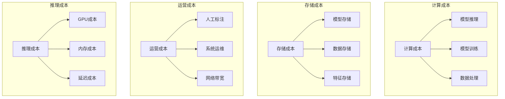
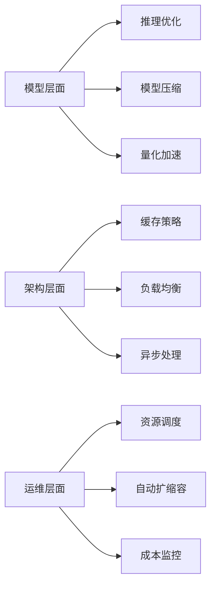

# 图11.5：成本优化策略

## 成本构成分析

```mermaid
flowchart TD
    subgraph 计算成本
        A[计算成本] --> A1[模型推理]
        A --> A2[模型训练]
        A --> A3[数据处理]
    end
    
    subgraph 存储成本
        B[存储成本] --> B1[模型存储]
        B --> B2[数据存储]
        B --> B3[特征存储]
    end
    
    subgraph 运营成本
        C[运营成本] --> C1[人工标注]
        C --> C2[系统运维]
        C --> C3[网络带宽]
    end
    
    subgraph 推理成本
        D[推理成本] --> D1[GPU成本]
        D --> D2[内存成本]
        D --> D3[延迟成本]
    end
```

## 成本优化措施

```mermaid
flowchart LR
    A[模型层面] --> D[推理优化]
    A --> E[模型压缩]
    A --> F[量化加速]
    
    B[架构层面] --> G[缓存策略]
    B --> H[负载均衡]
    B --> I[异步处理]
    
    C[运维层面] --> J[资源调度]
    C --> K[自动扩缩容]
    C --> L[成本监控]
```
