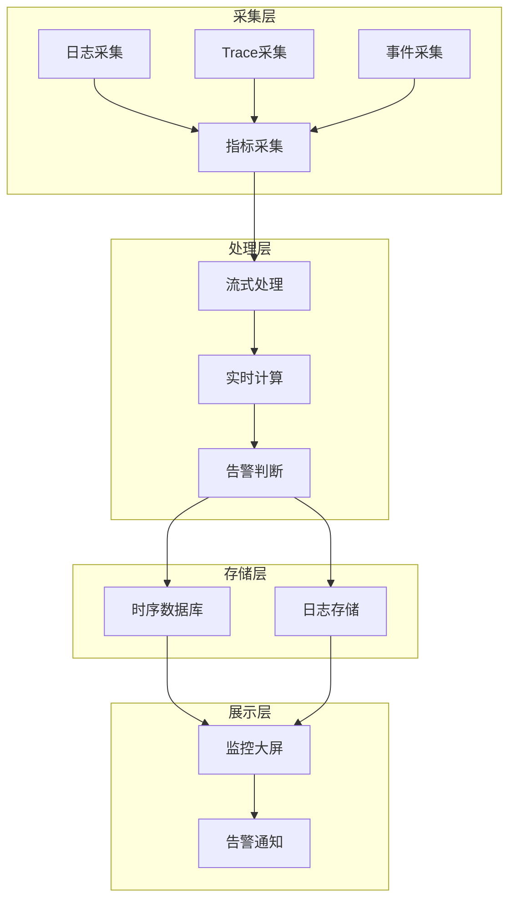
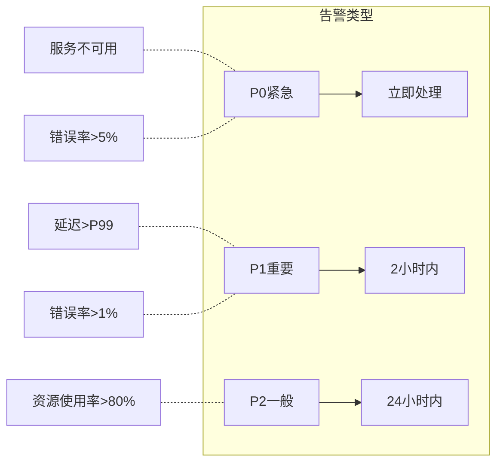

# 图11.6：监控系统架构

## 监控技术栈

```mermaid
flowchart TD
    subgraph 采集层
        A[日志采集] --> D[指标采集]
        B[Trace采集] --> D
        C[事件采集] --> D
    end
    
    subgraph 处理层
        D --> E[流式处理]
        E --> F[实时计算]
        F --> G[告警判断]
    end
    
    subgraph 存储层
        G --> H[时序数据库]
        G --> I[日志存储]
    end
    
    subgraph 展示层
        H --> J[监控大屏]
        I --> J
        J --> K[告警通知]
    end
```

## 核心告警规则

```mermaid
flowchart LR
    subgraph 告警类型
        A[P0紧急] --> D[立即处理]
        B[P1重要] --> E[2小时内]
        C[P2一般] --> F[24小时内]
    end
    
    A1[服务不可用] -.- A
    A2[错误率>5%] -.- A
    B1[延迟>P99] -.- B
    B2[错误率>1%] -.- B
    C1[资源使用率>80%] -.- C
```
