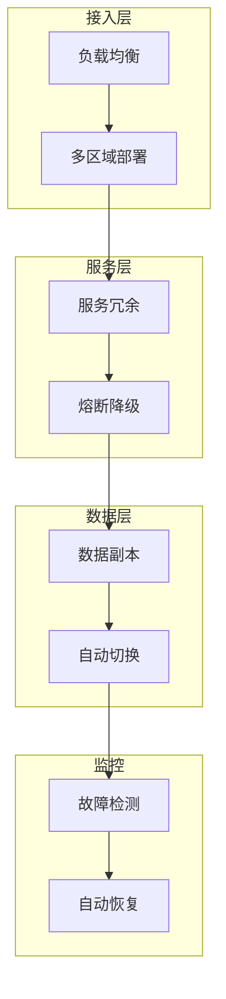

# 图11.7：容灾与高可用架构

## 高可用设计

```mermaid
flowchart TD
    subgraph 接入层
        A[负载均衡] --> B[多区域部署]
    end
    
    subgraph 服务层
        B --> C[服务冗余]
        C --> D[熔断降级]
    end
    
    subgraph 数据层
        D --> E[数据副本]
        E --> F[自动切换]
    end
    
    subgraph 监控
        F --> G[故障检测]
        G --> H[自动恢复]
    end
```

## 容灾策略

```mermaid
flowchart LR
    A[同城双活] --> B[异地多活]
    B --> C[跨区域容灾]
    C --> D[全球分布]
```
