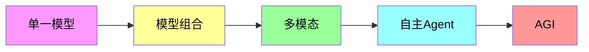

# 图12.1：技术发展趋势

## LLM服务未来方向

本章展望LLM服务的未来发展趋势：

```mermaid
flowchart TD
    subgraph 当前技术
        A[当前LLM服务] --> B[模型能力]
        A --> C[服务架构]
        A --> D[评测体系]
    end
    
    subgraph 短期趋势（1-2年）
        B --> E[多模态融合]
        C --> F[边缘部署]
        D --> G[自动化评测]
    end
    
    subgraph 中期趋势（3-5年）
        E --> H[AGI探索]
        F --> I[端云协同]
        G --> J[实时反馈]
    end
    
    subgraph 长期趋势（5年+）
        H --> K[通用智能]
        I --> L[泛在智能]
        J --> M[自我进化]
    end
```

## 技术演进路线


