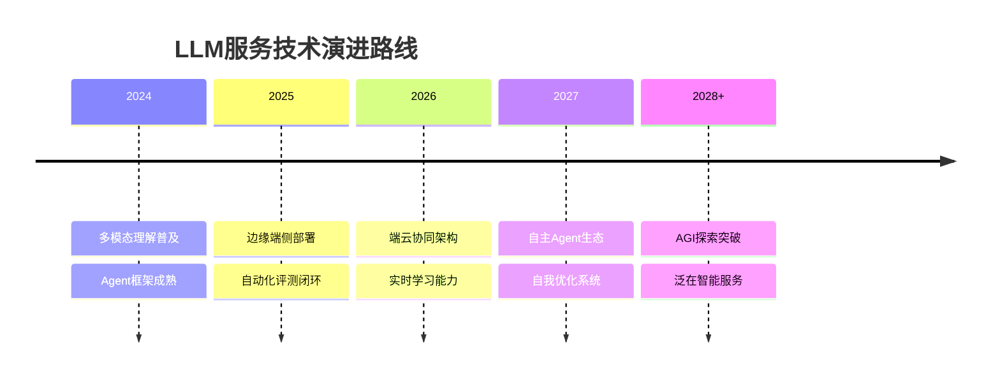
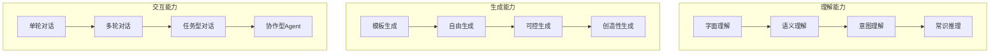

# 图12.2：技术发展路线图

## 关键里程碑预测

```mermaid
timeline
    title LLM服务技术演进路线
    2024 : 多模态理解普及
         :  Agent框架成熟
    2025 : 边缘端侧部署
         : 自动化评测闭环
    2026 : 端云协同架构
         : 实时学习能力
    2027 : 自主Agent生态
         : 自我优化系统
    2028+ : AGI探索突破
         : 泛在智能服务
```

## 技术能力演进

```mermaid
flowchart TD
    subgraph 理解能力
        A[字面理解] --> B[语义理解] --> C[意图理解] --> D[常识推理]
    end
    
    subgraph 生成能力
        E[模板生成] --> F[自由生成] --> G[可控生成] --> H[创造性生成]
    end
    
    subgraph 交互能力
        I[单轮对话] --> J[多轮对话] --> K[任务型对话] --> L[协作型Agent]
    end
```
