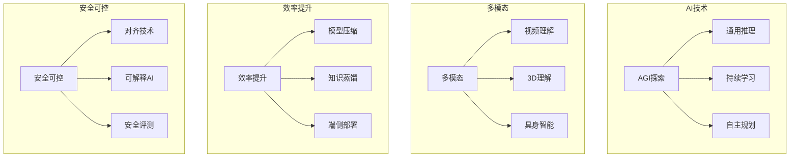
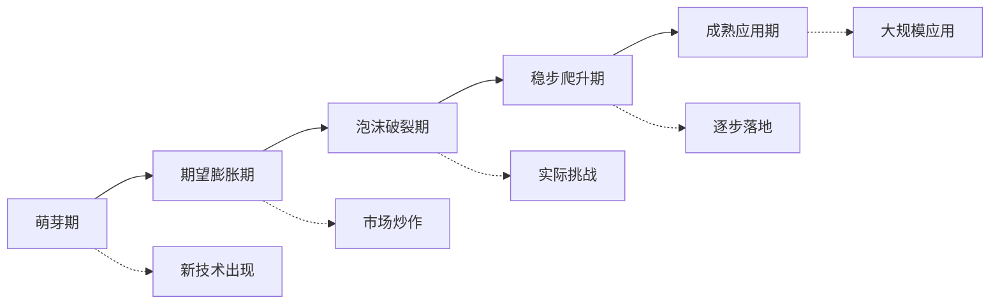

# 图12.3：新兴技术趋势

## 前沿技术方向

```mermaid
flowchart TD
    subgraph AI技术
        A[AGI探索] --> A1[通用推理]
        A --> A2[持续学习]
        A --> A3[自主规划]
    end
    
    subgraph 多模态
        B[多模态] --> B1[视频理解]
        B --> B2[3D理解]
        B --> B3[具身智能]
    end
    
    subgraph 效率提升
        C[效率提升] --> C1[模型压缩]
        C --> C2[知识蒸馏]
        C --> C3[端侧部署]
    end
    
    subgraph 安全可控
        D[安全可控] --> D1[对齐技术]
        D --> D2[可解释AI]
        D --> D3[安全评测]
    end
```

## 技术成熟度曲线

```mermaid
flowchart LR
    A[萌芽期] --> B[期望膨胀期]
    B --> C[泡沫破裂期]
    C --> D[稳步爬升期]
    D --> E[成熟应用期]
    
    A -.-> A1[新技术出现]
    B -.-> B1[市场炒作]
    C -.-> C1[实际挑战]
    D -.-> D1[逐步落地]
    E -.-> E1[大规模应用]
```
