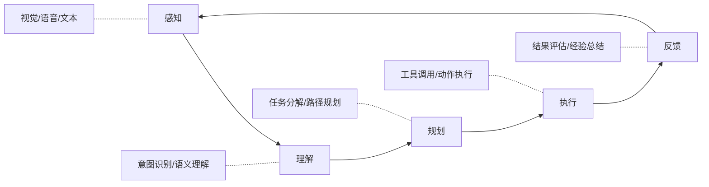

# 图12.4：AI Agent技术演进

## Agent能力分级

```mermaid
flowchart TD
    subgraph L0：无Agent
        A[简单调用] --> A1[单一任务]
        A1 --> A2[无记忆]
    end
    
    subgraph L1：基础Agent
        B[提示工程] --> B1[多轮对话]
        B1 --> B2[短期记忆]
    end
    
    subgraph L2：高级Agent
        C[工具使用] --> C1[任务规划]
        C1 --> C2[长期记忆]
    end
    
    subgraph L3：智能Agent
        D[自主学习] --> D1[反思推理]
        D1 --> D2[协作能力]
    end
    
    subgraph L4：超级Agent
        E[通用智能] --> E1[创造性]
        E1 --> E2[自我进化]
    end
    
    A --> B
    B --> C
    C --> D
    D --> E
```

## Agent技术架构


