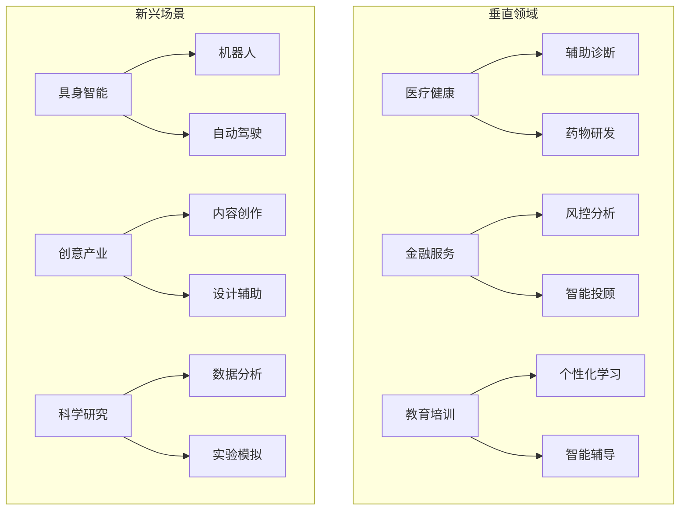
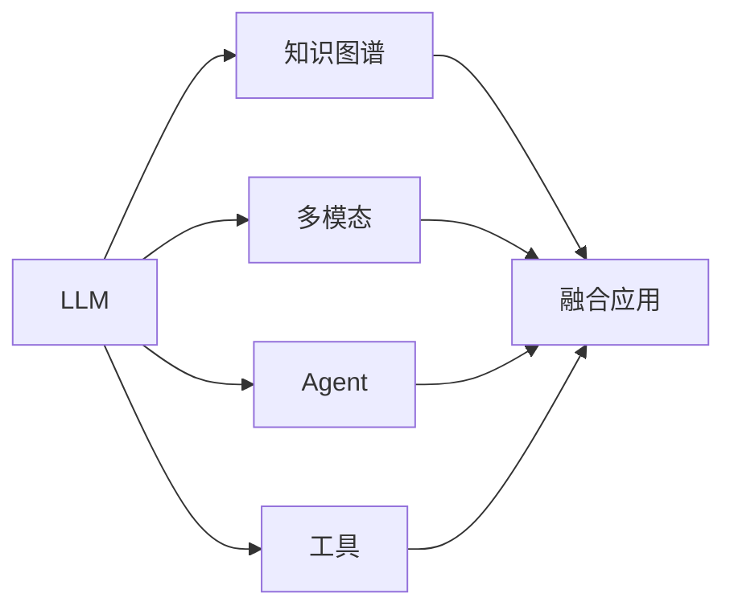

# 图12.5：未来应用场景

## 新兴应用领域

```mermaid
flowchart TD
    subgraph 垂直领域
        A[医疗健康] --> A1[辅助诊断]
        A --> A2[药物研发]
        
        B[金融服务] --> B1[风控分析]
        B --> B2[智能投顾]
        
        C[教育培训] --> C1[个性化学习]
        C --> C2[智能辅导]
    end
    
    subgraph 新兴场景
        D[具身智能] --> D1[机器人]
        D --> D2[自动驾驶]
        
        E[创意产业] --> E1[内容创作]
        E --> E2[设计辅助]
        
        F[科学研究] --> F1[数据分析]
        F --> F2[实验模拟]
    end
```

## 技术融合趋势

```mermaid
flowchart LR
    A[LLM] --> B[知识图谱]
    A --> C[多模态]
    A --> D[Agent]
    A --> E[工具]
    
    B --> F[融合应用]
    C --> F
    D --> F
    E --> F
```
