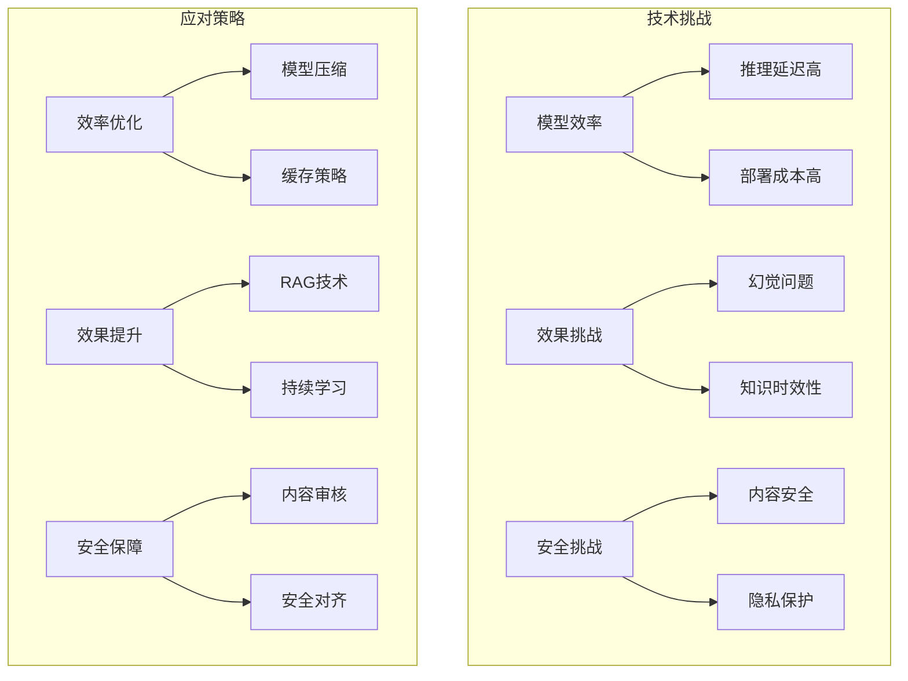

# 图12.6：技术挑战与应对

## 核心挑战分析

```mermaid
flowchart TD
    subgraph 技术挑战
        A[模型效率] --> A1[推理延迟高]
        A --> A2[部署成本高]
        
        B[效果挑战] --> B1[幻觉问题]
        B --> B2[知识时效性]
        
        C[安全挑战] --> C1[内容安全]
        C --> C2[隐私保护]
    end
    
    subgraph 应对策略
        D[效率优化] --> D1[模型压缩]
        D --> D2[缓存策略]
        
        E[效果提升] --> E1[RAG技术]
        E --> E2[持续学习]
        
        F[安全保障] --> F1[内容审核]
        F --> F2[安全对齐]
    end
```

## 解决方案对比

| 挑战 | 传统方案 | 新兴方案 | 推荐 |
|------|---------|----------|------|
| 延迟 | GPU加速 | 模型压缩+缓存 | 组合 |
| 幻觉 | 规则约束 | RAG+置信度 | RAG |
| 安全 | 人工审核 | AI+规则 | 分层 |
