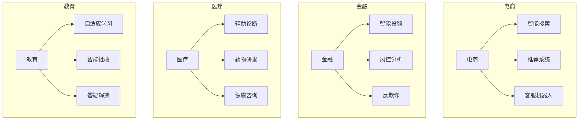

# 图12.7：行业应用案例

## 垂直行业应用

## 成功案例要素

| 行业 | 核心痛点 | LLM解决方案 | 关键成功因素 |
|------|---------|------------|-------------|
| 电商 | 搜索转化低 | 语义搜索 | 知识图谱 |
| 金融 | 风险识别难 | 智能分析 | 专业数据 |
| 医疗 | 诊断效率低 | 辅助诊断 | 安全合规 |
| 教育 | 个性化不足 | 自适应学习 | 用户画像 |
