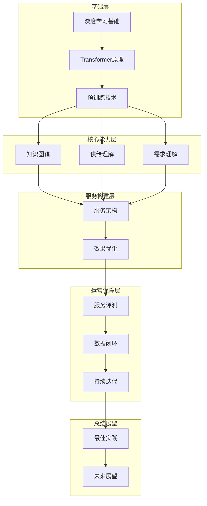

# 图13.1：全书知识体系总结

## 核心知识框架

本书构建了完整的LLM服务知识体系：

## 各章核心要点

| 章节 | 核心内容 | 关键技术 |
|------|---------|----------|
| 第1-2章 | 基础理论 | Transformer, BERT, 预训练 |
| 第3-4章 | 理解能力 | 知识图谱, 商品理解 |
| 第5-6章 | 匹配技术 | 向量检索, 排序模型 |
| 第7-8章 | 服务架构 | 工程实践, 性能优化 |
| 第9-10章 | 评测运维 | 指标体系, 闭环迭代 |
| 第11-13章 | 总结实践 | 案例分析, 未来趋势 |
