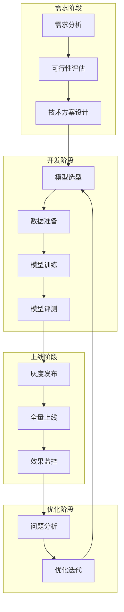
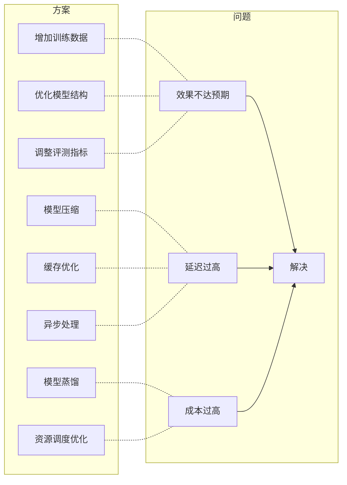

# 图13.2：最佳实践总结

## 开发流程最佳实践

```mermaid
flowchart TD
    subgraph 需求阶段
        A[需求分析] --> B[可行性评估]
        B --> C[技术方案设计]
    end
    
    subgraph 开发阶段
        C --> D[模型选型]
        D --> E[数据准备]
        E --> F[模型训练]
        F --> G[模型评测]
    end
    
    subgraph 上线阶段
        G --> H[灰度发布]
        H --> I[全量上线]
        I --> J[效果监控]
    end
    
    subgraph 优化阶段
        J --> K[问题分析]
        K --> L[优化迭代]
        L --> D
    end
```

## 常见问题与解决方案

```mermaid
flowchart LR
    subgraph 问题
        A[效果不达预期] --> D[解决]
        B[延迟过高] --> D
        C[成本过高] --> D
    end
    
    subgraph 方案
        A1[增加训练数据] -.- A
        A2[优化模型结构] -.- A
        A3[调整评测指标] -.- A
        B1[模型压缩] -.- B
        B2[缓存优化] -.- B
        B3[异步处理] -.- B
        C1[模型蒸馏] -.- C
        C2[资源调度优化] -.- C
    end
```
