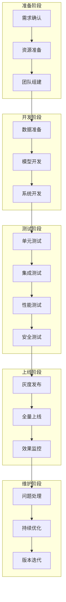

# 图13.3：项目实施检查清单

## 实施阶段检查点

## 各阶段关键产出

| 阶段 | 关键产出 | 质量标准 |
|------|---------|----------|
| 需求 | 需求文档 | 清晰完整 |
| 开发 | 可用模型 | 评测达标 |
| 测试 | 测试报告 | 覆盖率>80% |
| 上线 | 上线报告 | 无重大问题 |
| 维护 | 优化方案 | 持续改进 |
