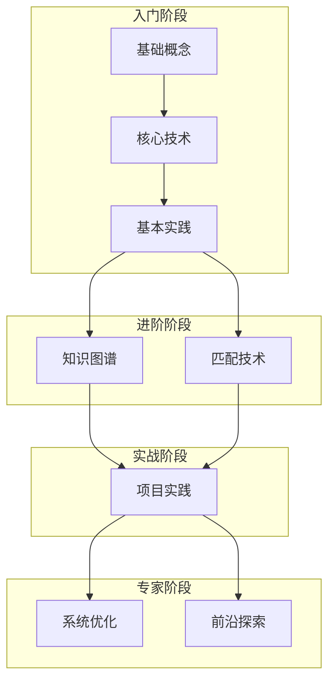
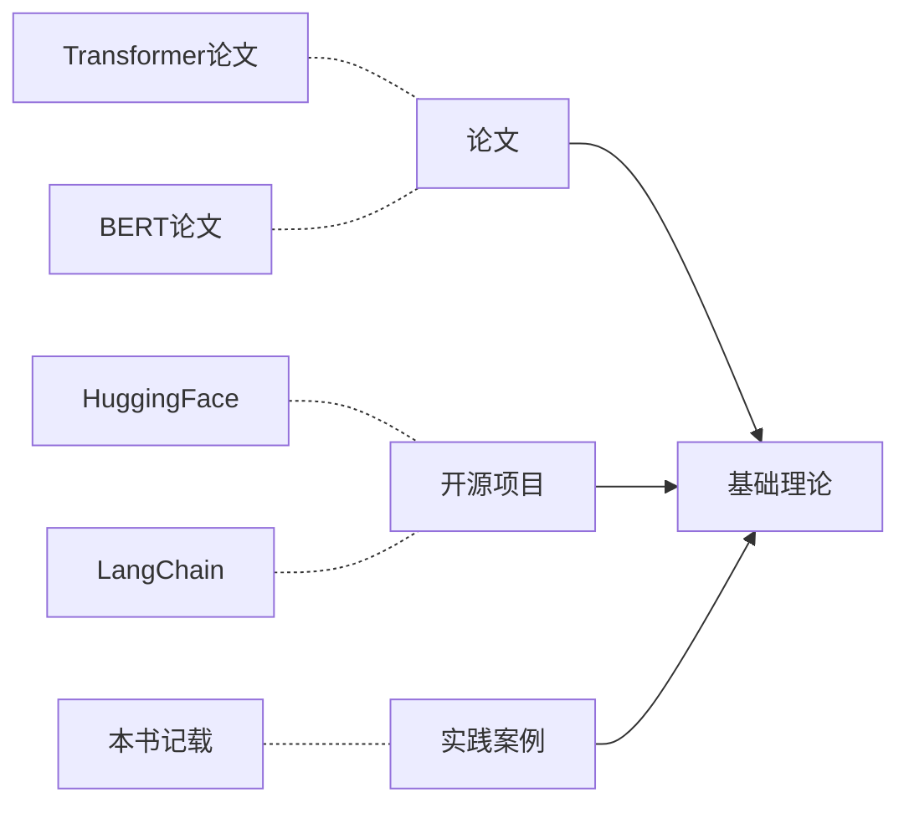

# 图13.4：学习路径建议

## 读者成长路径

```mermaid
flowchart TD
    subgraph 入门阶段
        A[基础概念] --> B[核心技术]
        B --> C[基本实践]
    end
    
    subgraph 进阶阶段
        C --> D[知识图谱]
        C --> E[匹配技术]
    end
    
    subgraph 实战阶段
        D --> F[项目实践]
        E --> F
    end
    
    subgraph 专家阶段
        F --> G[系统优化]
        F --> H[前沿探索]
    end
```

## 推荐学习资源

```mermaid
flowchart LR
    A[论文] --> D[基础理论]
    B[开源项目] --> D
    C[实践案例] --> D
    
    A1[Transformer论文] -.- A
    A2[BERT论文] -.- A
    B1[HuggingFace] -.- B
    B2[LangChain] -.- B
    C1[本书记载] -.- C
```
