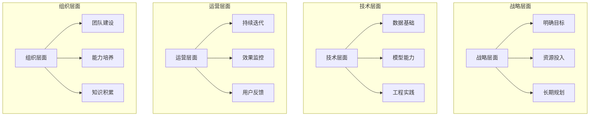
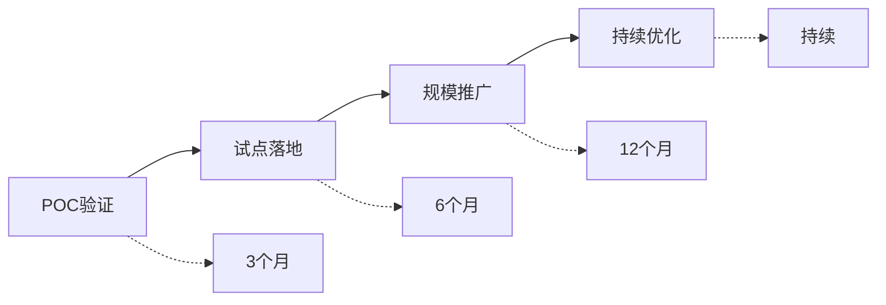

# 图13.5：实施建议与总结

## 关键成功因素

```mermaid
flowchart TD
    subgraph 战略层面
        A[战略层面] --> A1[明确目标]
        A --> A2[资源投入]
        A --> A3[长期规划]
    end
    
    subgraph 技术层面
        B[技术层面] --> B1[数据基础]
        B --> B2[模型能力]
        B --> B3[工程实践]
    end
    
    subgraph 运营层面
        C[运营层面] --> C1[持续迭代]
        C --> C2[效果监控]
        C --> C3[用户反馈]
    end
    
    subgraph 组织层面
        D[组织层面] --> D1[团队建设]
        D --> D2[能力培养]
        D --> D3[知识积累]
    end
```

## 分阶段实施路线

```mermaid
flowchart LR
    A[POC验证] --> B[试点落地]
    B --> C[规模推广]
    C --> D[持续优化]
    
    A -.-> A1[3个月]
    B -.-> B1[6个月]
    C -.-> C1[12个月]
    D -.-> D1[持续]
```
