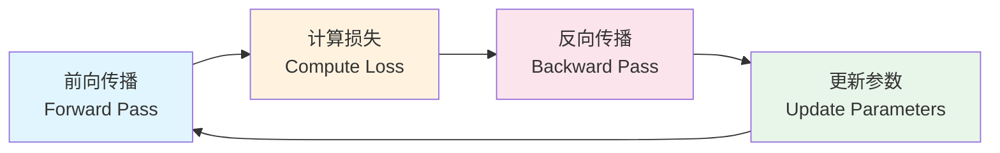
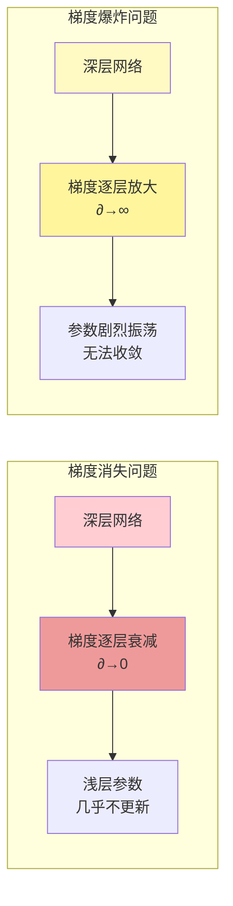
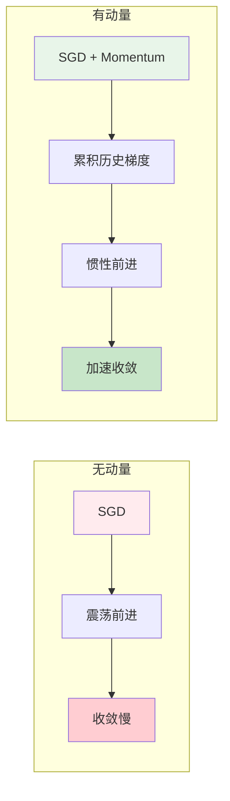

# 图1: 反向传播基本流程



**说明**: 深度学习训练的核心循环 - 前向传播计算输出，反向传播计算梯度，参数更新优化模型。

---

# 图2: 链式法则在反向传播中的应用

```mermaid
flowchart TB
    subgraph Forward["前向传播"]
        F1[x₁] --> F2[w₁]
        F2 --> F3[z₁ = w₁·x₁ + b₁]
        F3 --> F4[激活函数]
        F4 --> F5[a₁ = σ(z₁)]
        F5 --> F6[输出层]
        F6 --> F7[Loss]
    end
    
    subgraph Backward["反向传播"]
        B1[∂L/∂a] --> B2[∂L/∂z = ∂L/∂a · σ'(z)]
        B2 --> B3[∂L/∂w = ∂L/∂z · x]
        B3 --> B4[∂L/∂b = ∂L/∂z]
        B4 --> B5[∂L/∂x = ∂L/∂z · w]
    end
    
    style Forward fill:#e3f2fd
    style Backward fill:#ffebee
```

**说明**: 展示链式法则如何逐层传递梯度，每个参数接收来自上一层的梯度信号。

---

# 图3: 梯度消失与梯度爆炸



**说明**: 深度网络训练的两大难题 - 梯度消失导致深层网络无法训练，梯度爆炸导致数值不稳定。

---

# 图4: 梯度下降优化路径

```mermaid
flowchart TD
    A((起点<br/>w₀)) --> B[计算梯度<br/>∇L(w)]
    B --> C{梯度大小<br/>> ε?}
    C -->|是| D[更新参数<br/>w = w - η∇L]
    D --> B
    C -->|否| E((收敛<br/>最优解))
    
    style A fill:#e1f5fe
    style B fill:#b3e5fc
    style D fill:#81d4fa
    style E fill:#4caf50
```

**说明**: 经典梯度下降的迭代流程，不断沿梯度负方向更新参数直到收敛。

---

# 图5: 动量法加速收敛



**说明**: 动量法模拟物理中的惯性效应，帮助梯度下降穿越震荡区域加速收敛。
