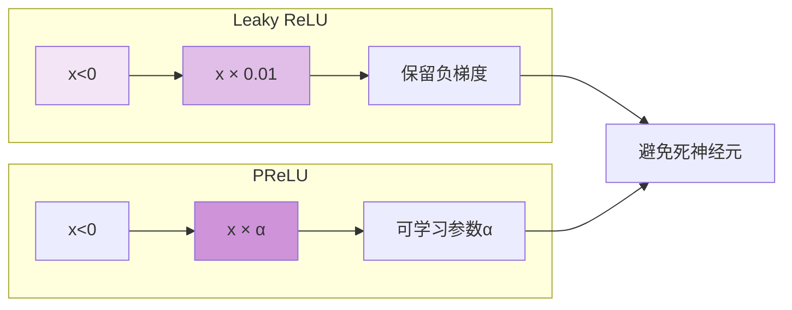
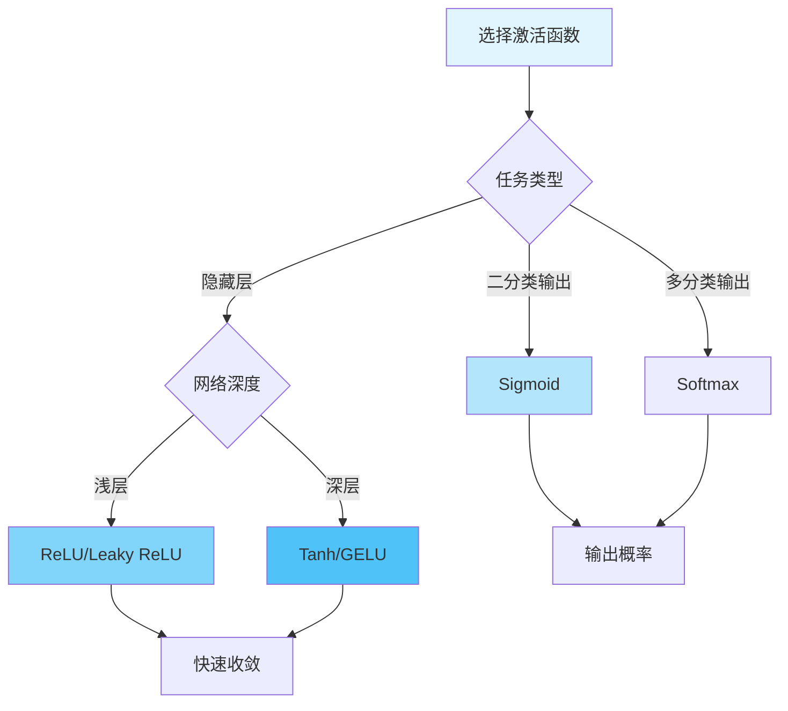

# 图1: Sigmoid激活函数

```mermaid
flowchart LR
    subgraph "Sigmoid σ(x)"
        S1[输入x] --> S2[1 / (1 + e⁻ˣ)]
        S2 --> S3[输出: 0~1]
    end
    
    S3 --> S4[特点]
    S4 --> S5[单调递增]
    S5 --> S6[S形曲线]
    S6 --> S7[梯度饱和]
    
    style S1 fill:#e3f2fd
    style S2 fill:#bbdefb
    style S3 fill:#90caf9
    style S7 fill:#ffcdd2
```

**说明**: Sigmoid将输入映射到(0,1)区间，常用于二分类输出层，但存在梯度饱和问题。

---

# 图2: Tanh激活函数

```mermaid
flowchart LR
    subgraph "Tanh(x)"
        T1[输入x] --> T2[(eˣ - e⁻ˣ) / (eˣ + e⁻ˣ)]
        T2 --> T3[输出: -1~1]
    end
    
    T3 --> T4[特点]
    T4 --> T5[零中心化]
    T5 --> T6[梯度更陡]
    T6 --> T7[仍有饱和区]
    
    style T1 fill:#e8f5e9
    style T2 fill:#c8e6c9
    style T3 fill:#a5d6a7
    style T7 fill:#ffcdd2
```

**说明**: Tanh输出以零为中心，比Sigmoid收敛更快，但仍存在梯度饱和问题。

---

# 图3: ReLU激活函数

```mermaid
flowchart LR
    subgraph "ReLU(x)"
        R1[输入x] --> R2{max(x, 0)}
        R2 -->|x>0| R3[输出=x]
        R2 -->|x≤0| R4[输出=0]
    end
    
    R3 --> R5[优点]
    R4 --> R5
    R5 --> R6[计算高效]
    R6 --> R7[缓解梯度消失]
    R7 --> R8[Dying ReLU问题]
    
    style R1 fill:#fff3e0
    style R3 fill:#ffe0b2
    style R4 fill:#ffcc80
    style R8 fill:#ffcdd2
```

**说明**: ReLU计算简单高效，是目前最常用的激活函数，但可能导致"死神经元"问题。

---

# 图4: Leaky ReLU与PReLU



**说明**: Leaky ReLU在负区间添加小斜率，PReLU将斜率设为可学习参数，解决Dying ReLU问题。

---

# 图5: 激活函数对比



**说明**: 根据任务和网络深度选择合适的激活函数，隐藏层推荐ReLU及其变体。
