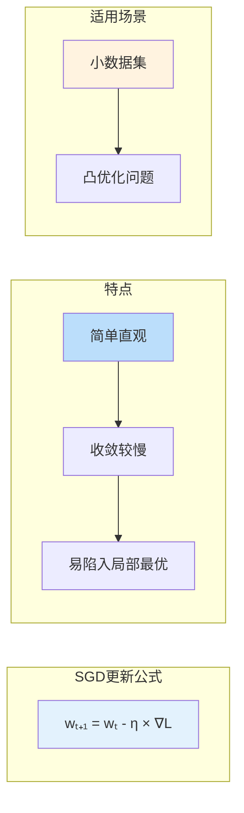
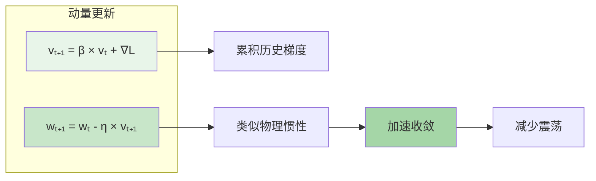
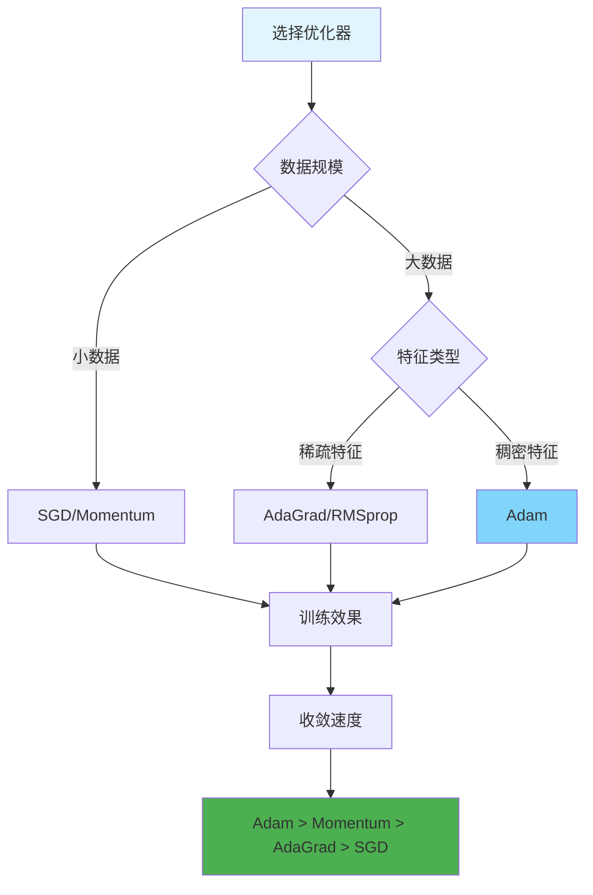

# 图1: SGD优化器



**说明**: 随机梯度下降是最基础的优化算法，每次使用单个样本计算梯度。

---

# 图2: SGD with Momentum



**说明**: 引入动量项累积历史梯度方向，帮助穿越震荡区域加速收敛。

---

# 图3: Adam优化器

```mermaid
flowchart LR
    subgraph "Adam两步"
        A1[一阶矩估计: m̂ = m / (1-β₁ᵗ)]
        A2[二阶矩估计: v̂ = v / (1-β₂ᵗ)]
        A3[参数更新: w = w - η × m̂ / (√v̂ + ε)]
    end
    
    A1 --> A4[自适应学习率]
    A2 --> A4
    A4 --> A5[适合大规模数据]
    A5 --> A6[深度学习默认选择]
    
    style A1 fill:#f3e5f5
    style A2 fill:#e1bee7
    style A5 fill:#ce93d8
```

**说明**: Adam结合动量和自适应学习率，是目前最流行的深度学习优化器。

---

# 图4: AdaGrad优化器

```mermaid
flowchart LR
    subgraph "AdaGrad更新"
        AG1[G += ∇L ⊙ ∇L]
        AG2[w = w - η × ∇L / √(G + ε)]
    end
    
    AG1 --> AG2
    AG2 --> AG3[自适应调整学习率]
    
    AG3 --> AG4[稀疏特征友好]
    AG4 --> AG5[学习率递减]
    
    style AG1 fill:#fff3e0
    AG2 fill:#ffe0b2
    style AG4 fill:#ffcc80
```

**说明**: AdaGrad对频繁更新的参数降低学习率，适合处理稀疏数据如文本嵌入。

---

# 图5: 优化器对比选择



**说明**: 根据数据规模和特征类型选择优化器，Adam是深度学习的通用首选。
