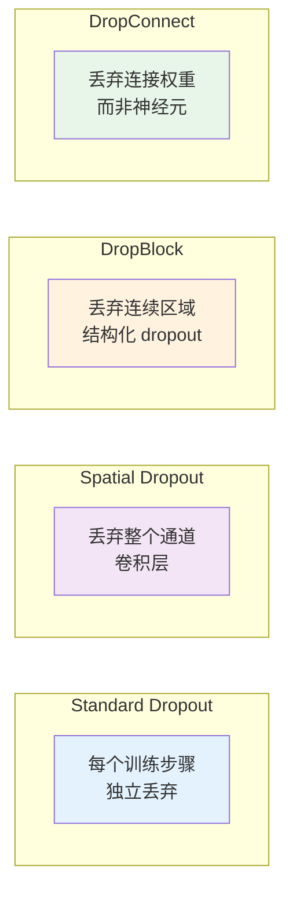
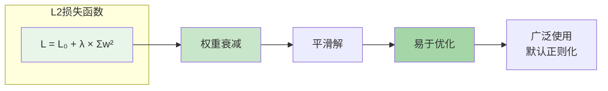
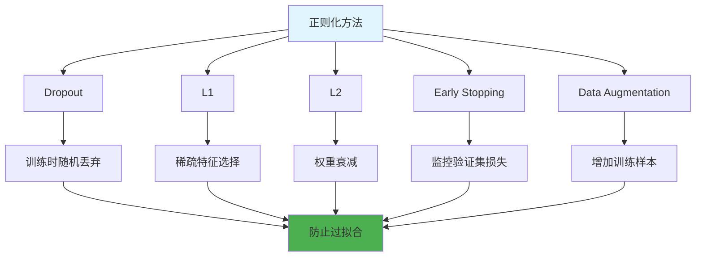

# 图1: Dropout原理

```mermaid
flowchart LR
    subgraph "训练阶段"
        D1[完整网络] --> D2[随机丢弃神经元]
        D2 --> D3[概率p]
        D3 --> D4[简化网络]
    end
    
    subgraph "测试阶段"
        D5[使用全部神经元]
        D5 --> D6[输出乘以(1-p)]
    end
    
    D4 --> D7[防止过拟合]
    D6 --> D7
    
    style D1 fill:#e3f2fd
    style D2 fill:#ffcdd2
    style D5 fill:#e8f5e9
```

**说明**: Dropout在训练时随机丢弃神经元，测试时使用完整网络并缩放输出，实现模型集成效果。

---

# 图2: Dropout变体



**说明**: 多种Dropout变体针对不同网络结构设计，提高正则化效果。

---

# 图3: L1正则化

```mermaid
flowchart LR
    subgraph "L1损失函数"
        L1[L = L₀ + λ × Σ|w|]
    end
    
    L1 --> L2[稀疏解]
    L2 --> L3[特征选择]
    L3 --> L4[不可导点]
    
    L4 --> L5[需特殊处理<br/>次梯度方法]
    
    style L1 fill:#e3f2fd
    L2 fill:#bbdefb
    style L3 fill:#90caf9
```

**说明**: L1正则化产生稀疏权重矩阵，可用于特征选择，但优化较困难。

---

# 图4: L2正则化



**说明**: L2正则化使权重趋向于小值，防止模型过度拟合，是最常用的正则化方法。

---

# 图5: 正则化方法对比



**说明**: 多种正则化方法可组合使用，深度学习中常同时使用Dropout、L2和数据增强。
