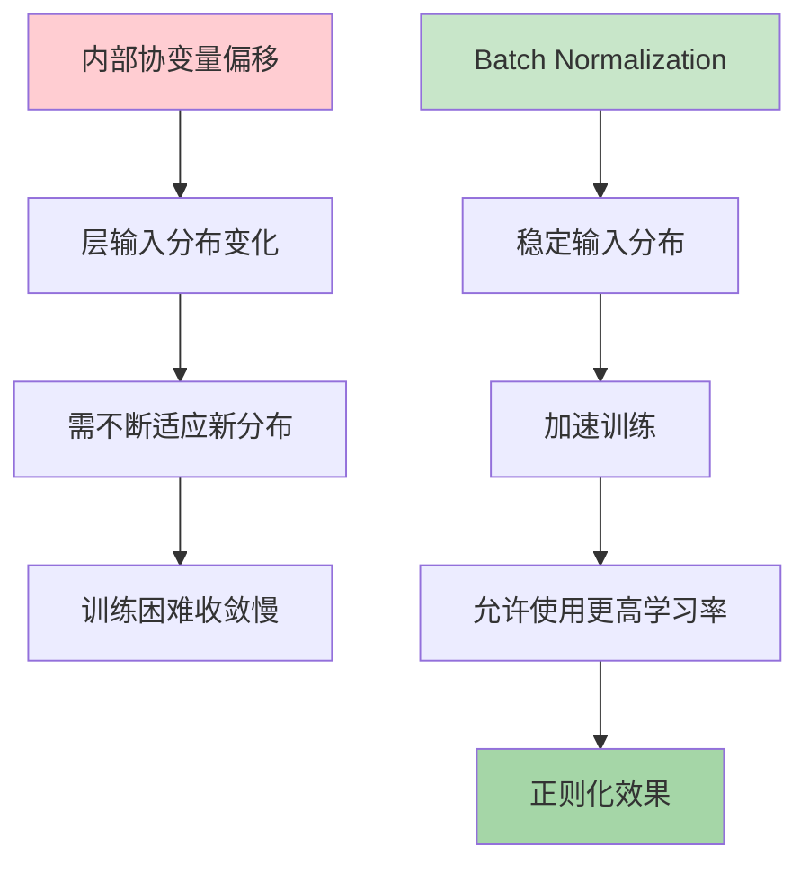
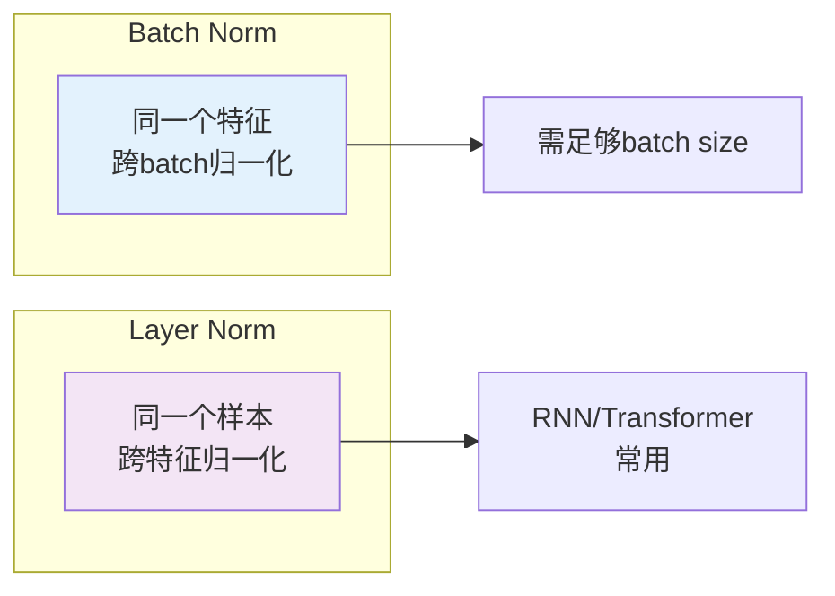
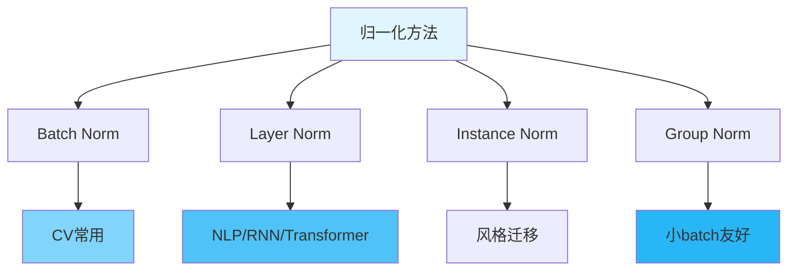

# 图1: Batch Normalization基本原理

```mermaid
flowchart LR
    subgraph "BN操作"
        BN1[输入: x] --> BN2[计算均值μ]
        BN2 --> BN3[计算方差σ²]
        BN3 --> BN4[标准化: x̂ = (x-μ)/√(σ²+ε)]
        BN4 --> BN5[缩放平移: y = γx̂ + β]
    end
    
    BN5 --> BN6[输出: y]
    BN6 --> BN7[可学习参数γ,β]
    
    style BN1 fill:#e3f2fd
    style BN4 fill:#ffcdd2
    style BN5 fill:#c8e6c9
```

**说明**: Batch Normalization将每层输入标准化到均值为0方差为1，再通过γ、β学习适合的分布。

---

# 图2: 训练与推理的BN

```mermaid
flowchart LR
    subgraph "训练阶段"
        T1[当前batch计算μ,σ] --> T2[移动平均更新全局统计量]
    end
    
    subgraph "推理阶段"
        I1[使用保存的全局统计量] --> I2[标准化]
    end
    
    T2 --> T3[E[x] ≈ μ, Var[x] ≈ σ²]
    I1 --> T3
    
    style T1 fill:#fff3e0
    style I1 fill:#e8f5e9
```

**说明**: 训练时使用batch统计量并更新移动平均，推理时使用预计算的全局统计量。

---

# 图3: BN的作用机制



**说明**: BN通过稳定层间输入分布，解决内部协变量偏移问题，加速训练并有正则化效果。

---

# 图4: Layer Normalization



**说明**: Layer Normalization对单个样本的特征进行归一化，不依赖batch大小，适合RNN和Transformer。

---

# 图5: 归一化方法对比



**说明**: 不同归一化方法适用于不同场景，CV常用BN，NLP用LN，Group Norm折中处理batch依赖问题。
