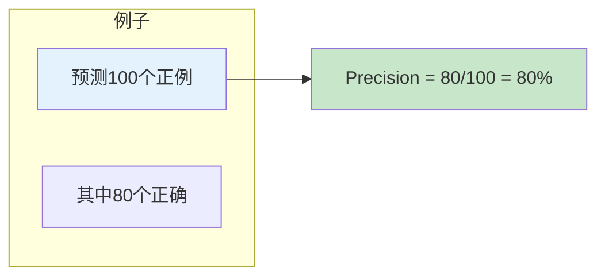
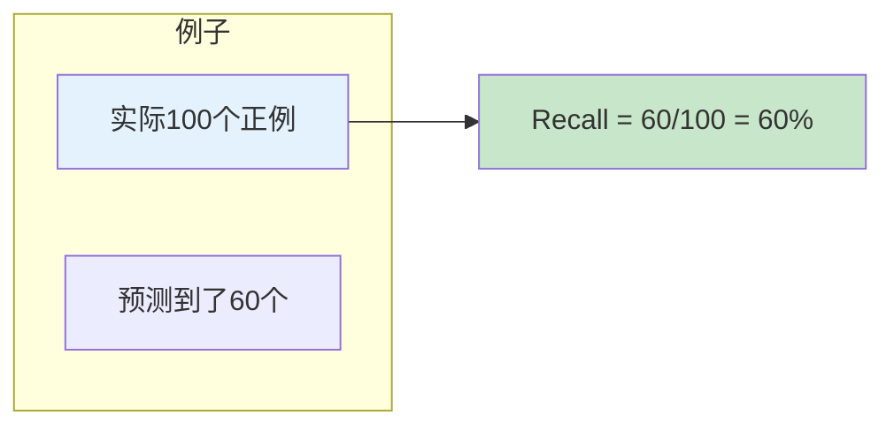
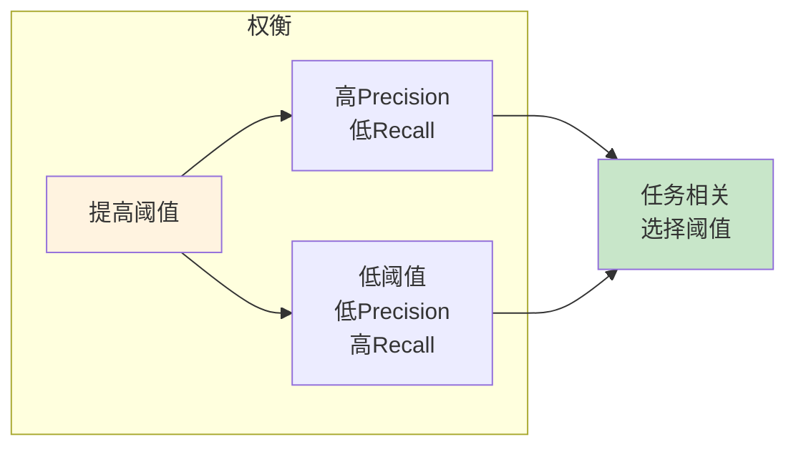

# 图1: Precision/Recall基本概念

```mermaid
flowchart LR
    subgraph "混淆矩阵"
        TP[真正例 TP]
        TN[真负例 TN]
        FP[假正例 FP]
        FN[假负例 FN]
    end
    
    TP --> P1[Precision = TP/(TP+FP)]
    FN --> R1[Recall = TP/(TP+FN)]
    
    style TP fill:#c8e6c9
    style FP fill:#ffcdd2
```

**说明**: Precision衡量预测为正例中真正例的比例，Recall衡量实际正例被正确预测的比例。

---

# 图2: Precision计算示例



**说明**: Precision关注预测的准确性，高Precision意味着少的误报。

---

# 图3: Recall计算示例



**说明**: Recall关注覆盖的全面性，高Recall意味着少的漏报。

---

# 图4: Precision-Recall平衡



**说明**: Precision和Recall通常权衡，高阈值提高Precision降低Recall，反之亦然。

---

# 图5: F1-Score

```mermaid
flowchart LR
    subgraph "F1公式"
        F1[F1 = 2 × P × R / (P + R)]
    end
    
    F1 --> F2[调和平均]
    F2 --> F3[综合评估]
    
    style F1 fill:#e3f2fd
    style F3 fill:#c8e6c9
```

**说明**: F1是Precision和Recall的调和平均，平衡两者，是常用的综合指标。
