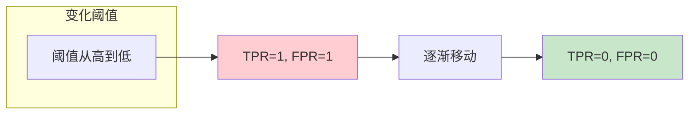
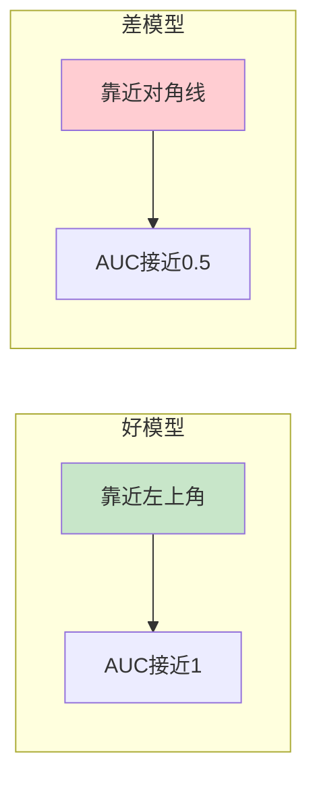

# 图1: ROC曲线原理

```mermaid
flowchart LR
    subgraph "坐标轴"
        Y[Y轴: TPR<br/>真正例率]
        X[X轴: FPR<br/>假正例率]
    end
    
    Y --> ROC[TPR = TP/(TP+FN)]
    X --> ROC[FPR = FP/(TN+FP)]
    
    style Y fill:#e3f2fd
    style ROC fill:#c8e6c9
```

**说明**: ROC曲线展示不同阈值下真正例率与假正例率的 tradeoff。

---

# 图2: ROC曲线绘制



**说明**: 调整分类阈值，从最高到最低，绘制对应的(TPR, FPR)点连成ROC曲线。

---

# 图3: AUC含义

```mermaid
flowchart LR
    subgraph "AUC值"
        A1[曲线下面积]
    end
    
    A1 --> A2[1.0: 完美分类]
    A1 --> A3[0.5: 随机猜测]
    A1 --> A4[0.0: 完全错误]
    
    style A1 fill:#e3f2fd
    A2 fill:#c8e6c9
    style A4 fill:#ffcdd2
```

**说明**: AUC是ROC曲线下的面积，取值0-1，越接近1表示分类器越好。

---

# 图4: AUC计算方法

```mermaid
flowchart LR
    subgraph "计算方式"
        C1[正负样本配对]
        C1 --> C2[计算正样本得分<br/>高于负样本概率]
    end
    
    C2 --> C3[AUC = P(score₊ > score₋)]
    
    style C1 fill:#fff3e0
    style C3 fill:#c8e6c9
```

**说明**: AUC等价于随机正样本得分高于随机负样本的概率，是排序质量度量。

---

# 图5: ROC曲线对比



**说明**: 好的分类器ROC曲线靠近左上角，随机分类器沿对角线分布。
