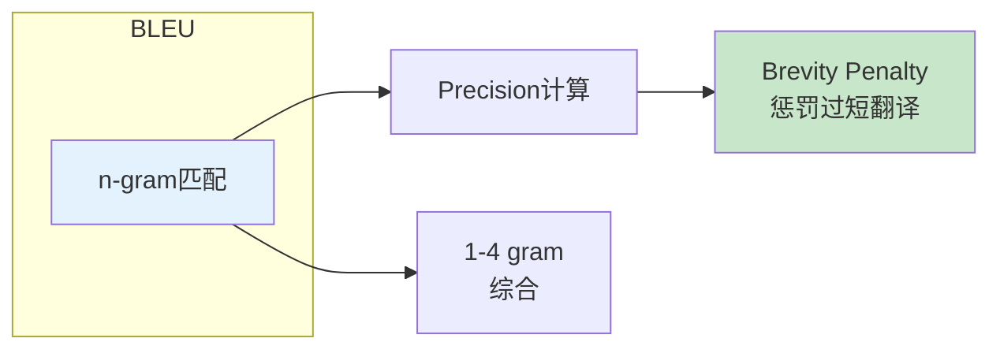
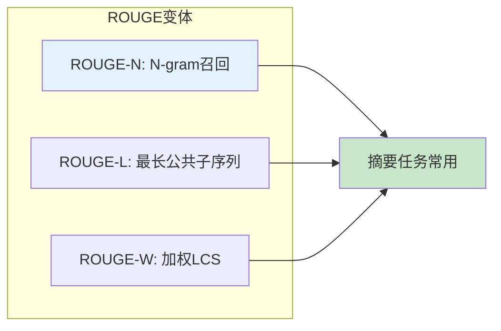
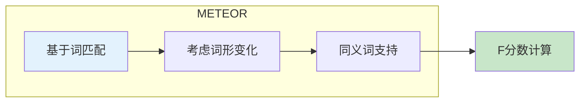
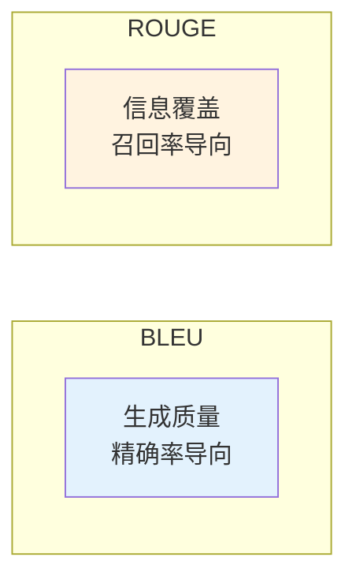
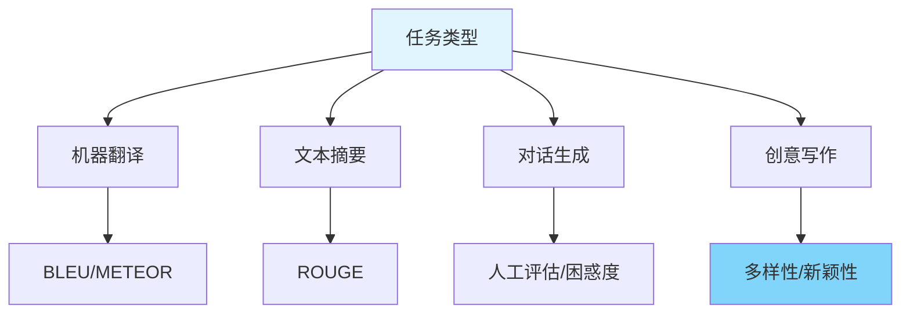

# 图1: BLEU评分原理

**说明**: BLEU通过n-gram精确率衡量生成文本与参考文本的相似度，加入BP惩罚短句。

---

# 图2: ROUGE评分

**说明**: ROUGE是一系列召回率指标，BLEU是精确率，ROUGE更适合评估摘要任务。

---

# 图3: METEOR评分

**说明**: METEOR考虑词形变化和同义词，比BLEU更接近人工评估，但对生成文本较长时效果下降。

---

# 图4: BLEU vs ROUGE对比

**说明**: BLEU适合评估翻译质量(精确率)，ROUGE适合评估摘要(召回率)。

---

# 图5: 生成指标选择

**说明**: 根据任务类型选择合适指标，生成类任务常需结合多个指标和人工评估。
