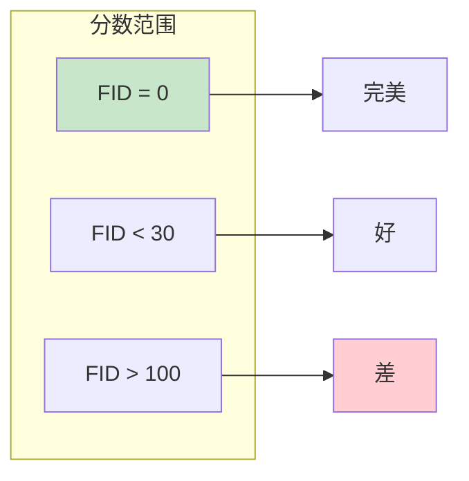
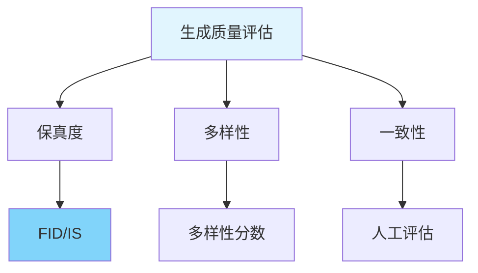

# 图1: FID指标原理

```mermaid
flowchart LR
    subgraph "FID计算"
        F1[提取真实图像<br/>Inception特征]
        F1 --> F2[提取生成图像<br/>Inception特征]
    end
    
    F2 --> F3[计算FID距离]
    F3 --> F4[FID = ||μ₁-μ₂||² + Tr(Σ₁+Σ₂-2(Σ₁Σ₂)¹/²]
    
    style F1 fill:#e3f2fd
    style F4 fill:#c8e6c9
```

**说明**: FID(Frechet Inception Distance)通过Inception网络提取特征，计算真实和生成图像分布的距离。

---

# 图2: FID值含义



**说明**: FID越小越好，0表示完美生成，低分(<30)表示高质量，高分表示质量差。

---

# 图3: 多样性指标

```mermaid
flowchart LR
    subgraph "多样性度量"
        D1[生成样本间距离]
        D1 --> D2[多样性 = avg(pairwise dist)]
    end
    
    D2 --> D3[避免模式坍塌]
    
    style D1 fill:#fff3e0
    style D3 fill:#c8e6c9
```

**说明**: 多样性指标衡量生成样本之间的差异，防止模型只生成单一类型样本。

---

# 图4: 质量与多样性平衡

```mermaid
flowchart LR
    subgraph "模式坍塌"
        M1[低多样性<br/>重复样本]
    end
    
    subgraph "理想状态]
        I1[高质量 + 高多样性]
    end
    
    style M1 fill:#ffcdd2
    style I1 fill:#c8e6c9
```

**说明**: 生成模型需要在质量(FID)和多样性间平衡，模式坍塌是常见问题。

---

# 图5: 评估指标综合



**说明**: 完整评估生成模型需要多个指标结合，保真度、多样性和一致性缺一不可。
