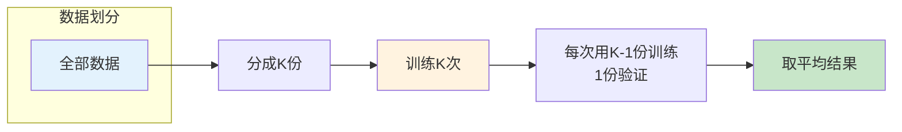
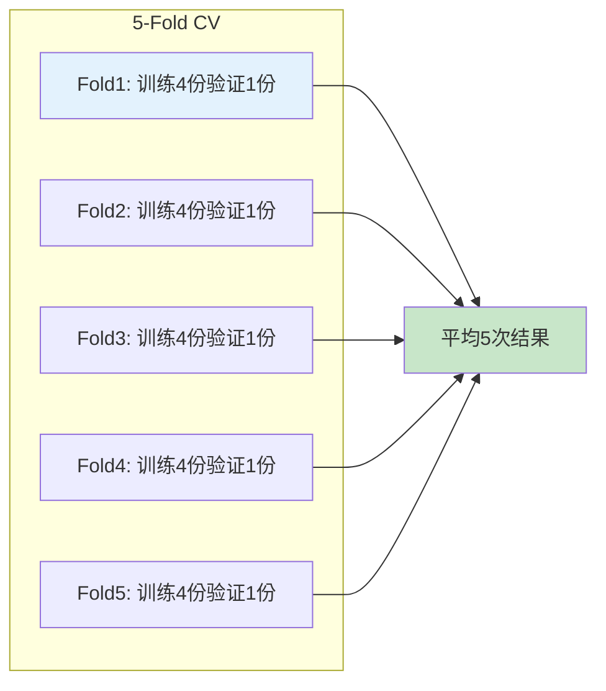
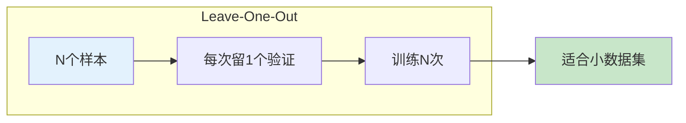
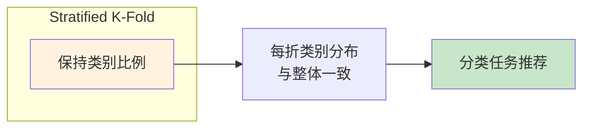
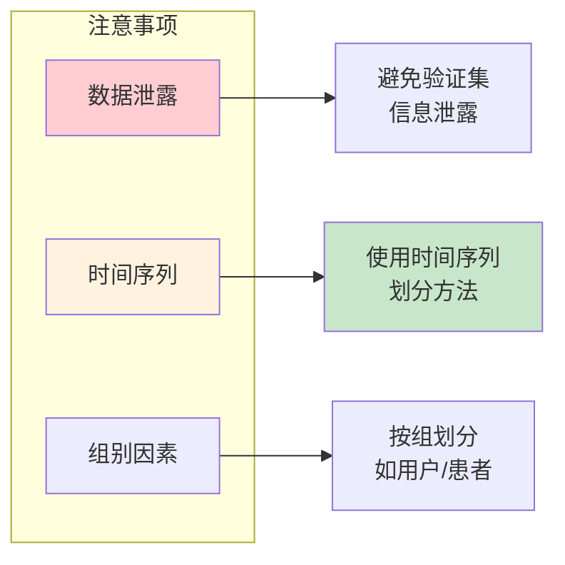

# 图1: K折交叉验证流程

**说明**: K折交叉验证将数据分成K份，轮流作为验证集，得到更稳定可靠的性能评估。

---

# 图2: 5折交叉验证示例

**说明**: 5折交叉验证是常用选择，数据量小时可用10折，数据量大时可减少折数。

---

# 图3: 留一法交叉验证

**说明**: 留一法每次只留一个样本做验证，训练N次，适合小数据但计算成本高。

---

# 图4: 分层K折

**说明**: 分层K折保证每折中各类别比例与整体一致，适合不平衡分类问题。

---

# 图5: 交叉验证注意事项

**说明**: 注意数据泄露问题，时间序列和分组数据需要特殊划分方法。
