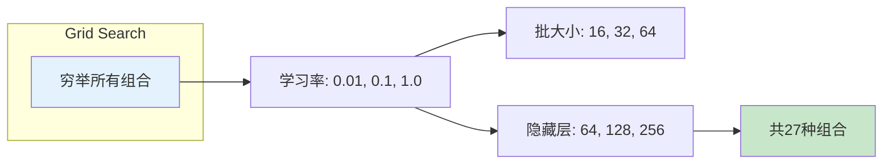
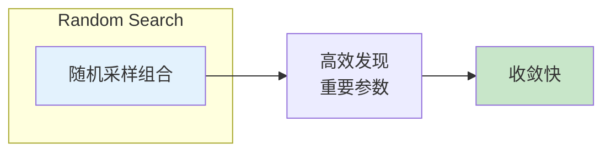
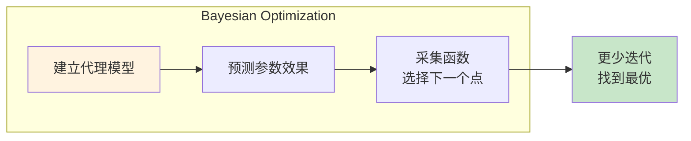
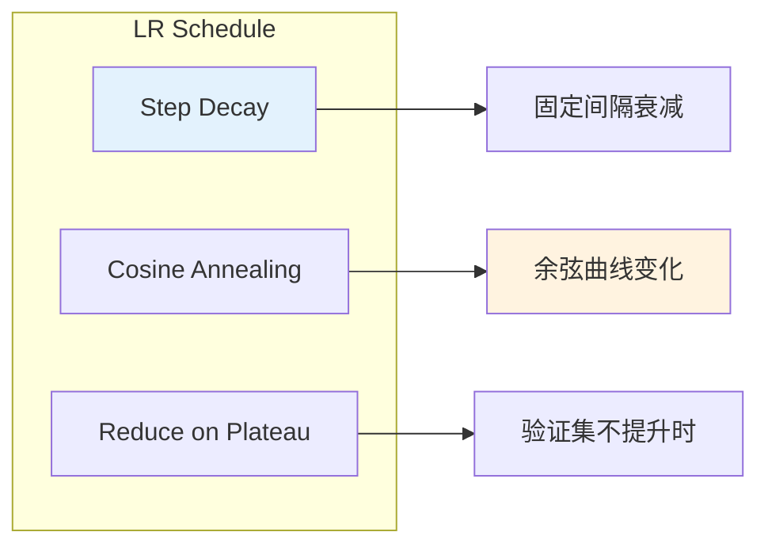
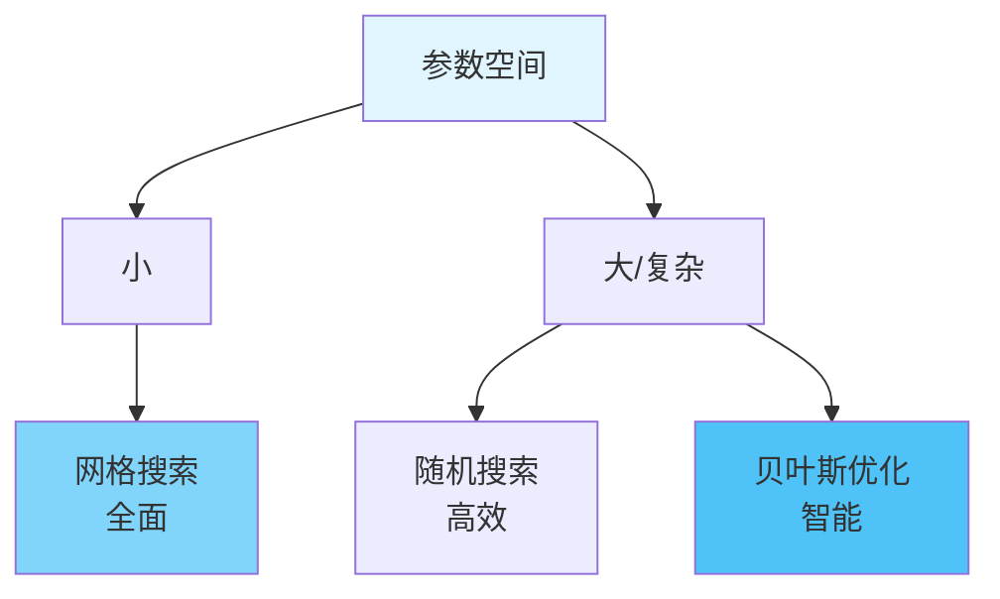

# 图1: 网格搜索

**说明**: 网格搜索穷举所有参数组合，简单全面但计算成本高，适合参数空间不大时。

---

# 图2: 随机搜索

**说明**: 随机搜索在参数空间随机采样，往往比网格搜索更高效，尤其是高维空间。

---

# 图3: 贝叶斯优化

**说明**: 贝叶斯优化利用历史结果建模参数-效果关系，智能选择下一个评估点，效率最高。

---

# 图4: 学习率调度

**说明**: 学习率调度动态调整学习率，常用方法有按步衰减、余弦退火和早停策略。

---

# 图5: 超参数搜索策略选择

**说明**: 根据参数空间大小选择搜索策略，网格搜索全面，随机搜索高效，贝叶斯最智能。
