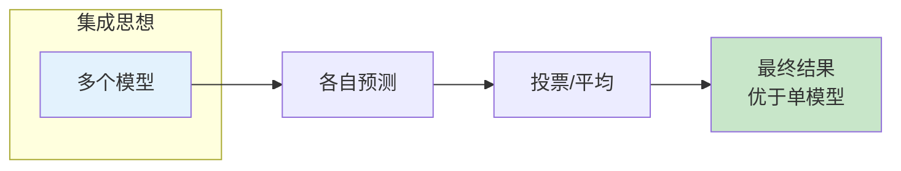
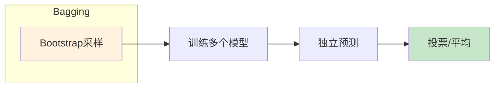
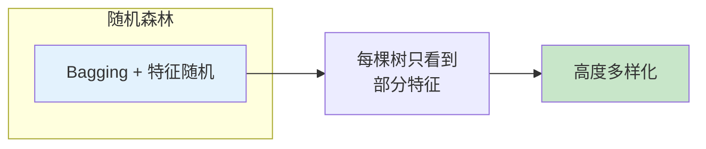
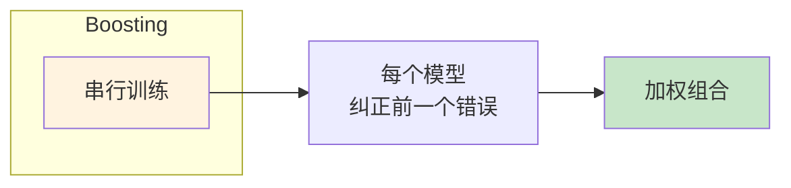
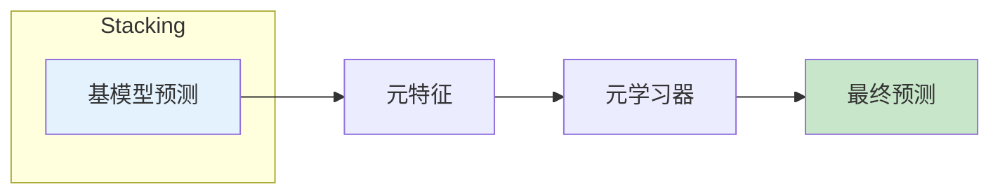

# 图1: 集成学习概述

**说明**: 集成学习通过组合多个模型提升整体性能，是Kaggle等竞赛的常用技巧。

---

# 图2: Bagging

**说明**: Bagging通过Bootstrap有放回采样训练多个模型，降低方差，适合不稳定模型如决策树。

---

# 图3: Random Forest

**说明**: Random Forest是Bagging的扩展，随机选择特征子集，增加模型多样性。

---

# 图4: Boosting

**说明**: Boosting串行训练模型，每个模型关注前一个的错误，最终加权组合，降低偏差。

---

# 图5: Stacking

**说明**: Stacking使用基模型预测作为元特征，训练元学习器组合，是更高级的集成方法。
