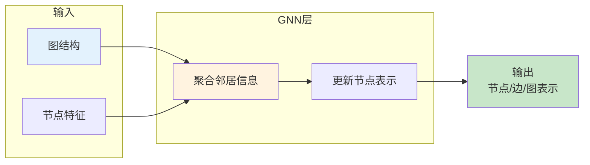
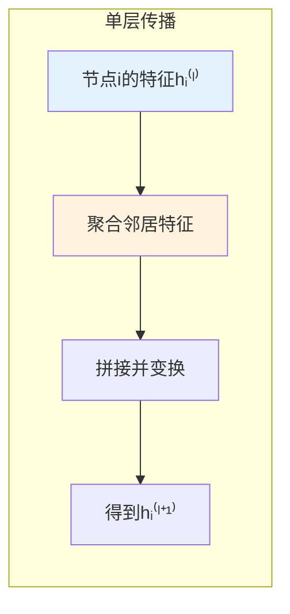
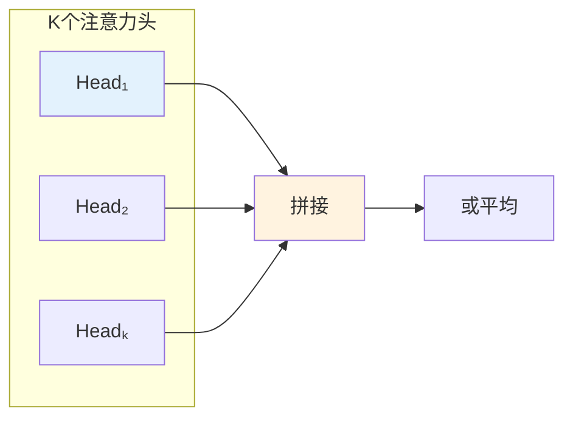
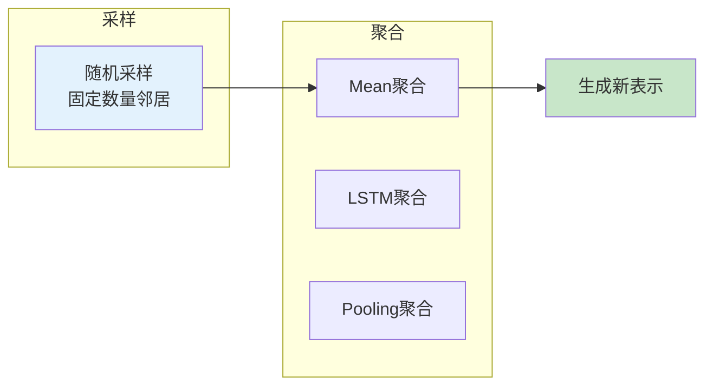
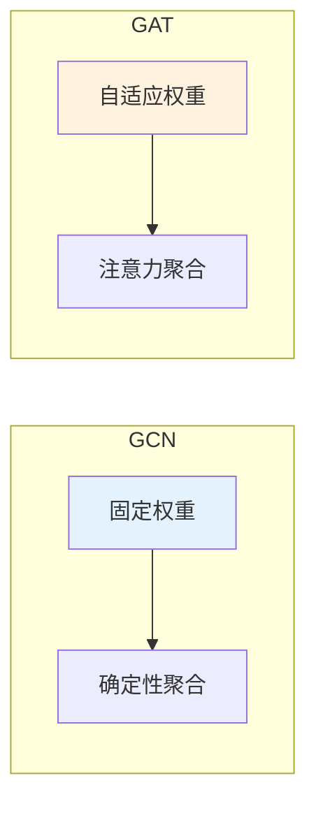
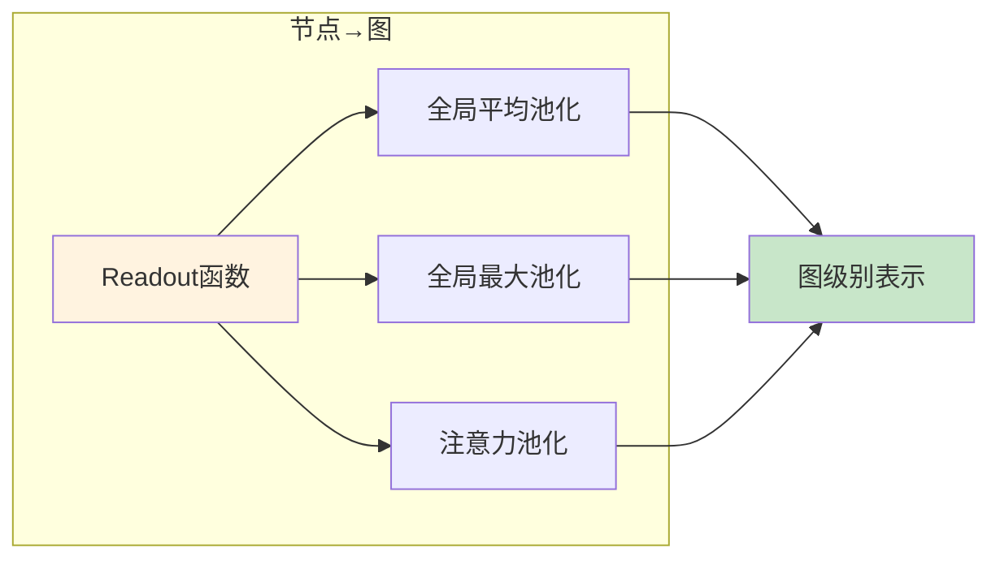
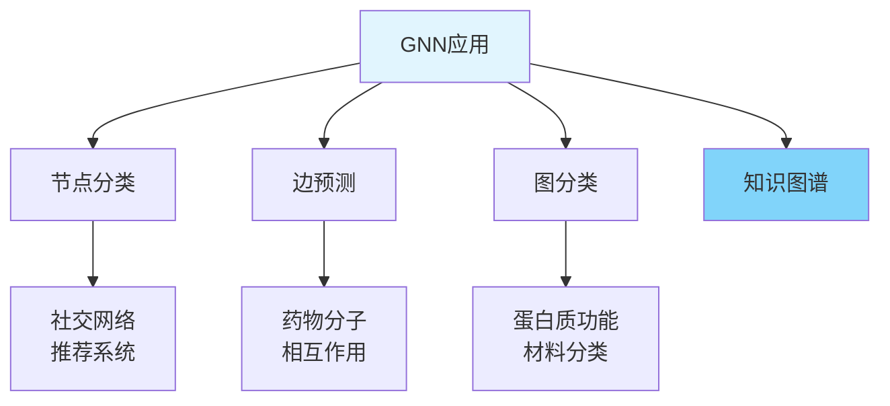

# 图1: 图神经网络概述



**说明**: 图神经网络通过聚合邻居节点信息来更新节点表示，学习图结构中的模式。

---

# 图2: GCN卷积操作

```mermaid
flowchart LR
    subgraph "GCN公式"
        GC1[H⁽ˡ⁺¹⁾ = σ(D̃⁻¹/²ÃD̃⁻¹/² H⁽ˡ⁾ W⁽ˣ⁾]
    end
    
    GC1 --> GC2[邻接矩阵归一化]
    GC2 --> GC3[特征变换]
    GC3 --> GC4[非线性激活]
    
    style GC1 fill:#e3f2fd
    style GC4 fill:#c8e6c9
```

**说明**: 图卷积网络GCN通过归一化邻接矩阵实现卷积操作，结合特征变换和非线性激活。

---

# 图3: GCN层间传播



**说明**: GCN每层将节点自身特征与邻居特征聚合，经过变换得到新的节点表示。

---

# 图4: 图注意力网络(GAT)

```mermaid
flowchart LR
    subgraph "注意力机制"
        A1[计算注意力系数]
        A1 --> A2[αᵢⱼ = softmax(LeakyReLU(aᵀ[Whᵢ||Whⱼ]))]
    end
    
    A2 --> A3[加权聚合]
    A3 --> A4[hᵢ⁽ˡ⁺¹⁾ = σ(ΣⱼαᵢⱼWhⱽ⁽ˡ⁾)]
    
    style A1 fill:#fff3e0
    style A4 fill:#c8e6c9
```

**说明**: GAT引入注意力机制，让节点自适应地决定对不同邻居的注意力权重。

---

# 图5: 多头注意力GAT



**说明**: GAT使用多头注意力增加模型稳定性，类似Multi-Head Attention。

---

# 图6: GraphSAGE采样聚合



**说明**: GraphSAGE通过采样和多种聚合函数，支持归纳学习，能够处理新节点。

---

# 图7: GCN vs GAT对比



**说明**: GCN使用固定的图结构权重，GAT学习动态的注意力权重，更灵活。

---

# 图8: 消息传递神经网络

```mermaid
flowchart LR
    subgraph "消息传递"
        M1[节点发送消息<br/>mᵢⱼ = f(hᵢ, hⱼ, eᵢⱼ)]
    end
    
    M1 --> M2[消息聚合]
    M2 --> M3[节点更新<br/>hᵢ' = g(hᵢ, Σmᵢⱼ)]
    
    style M1 fill:#fff3e0
    style M3 fill:#c8e6c9
```

**说明**: 消息传递网络框架包含消息生成、聚合和更新三个步骤，是GNN的通用框架。

---

# 图9: 图 pooling 操作



**说明**: 图Pooling将节点级别表示聚合成图级别表示，用于图分类任务。

---

# 图10: GNN应用场景



**说明**: GNN广泛用于节点分类、边预测、图分类和知识图谱等任务。
