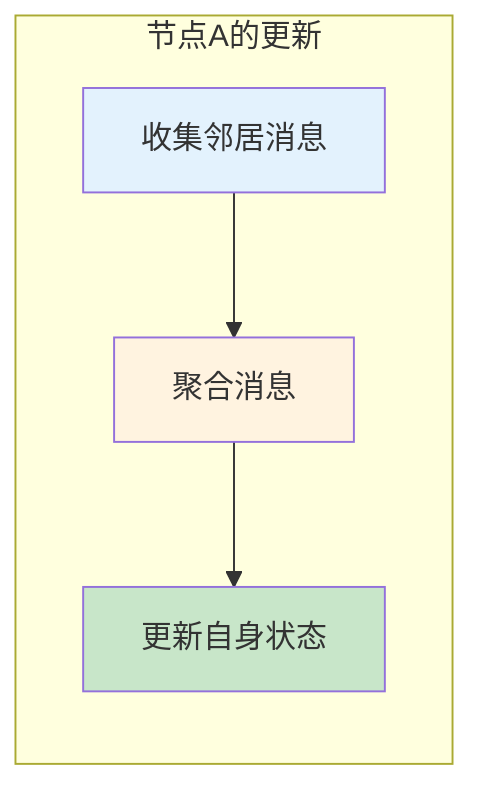
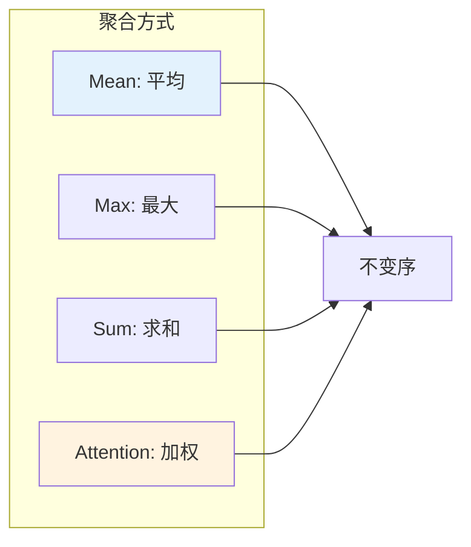
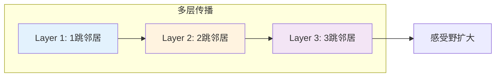
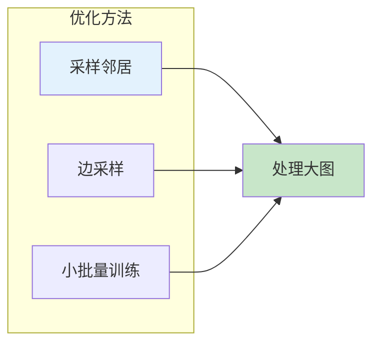

# 图1: 消息传递基本流程



**说明**: 消息传递神经网络中，节点通过聚合邻居消息来更新自己的表示。

---

# 图2: 消息函数设计

```mermaid
flowchart LR
    subgraph "消息计算"
        MSG1[mᵢⱼ = f(hᵢ, hⱼ)]
    end
    
    MSG1 --> MSG2[基于节点特征]
    MSG1 --> MSG3[基于边特征eᵢⱼ]
    
    MSG2 --> MSG4[灵活的消息函数]
    
    style MSG1 fill:#fff3e0
    style MSG4 fill:#c8e6c9
```

**说明**: 消息函数可以设计为只考虑节点特征，或同时加入边特征，增强表达能力。

---

# 图3: 聚合函数类型



**说明**: 聚合函数应对节点顺序不变，常用的有Mean、Max、Sum和Attention。

---

# 图4: 多轮消息传递



**说明**: 多层GNN堆叠使节点能够聚合更远距离的信息，扩大感受野。

---

# 图5: 消息传递效率优化



**说明**: 对大图进行邻居采样或边采样，使用小批量训练提高计算效率。
