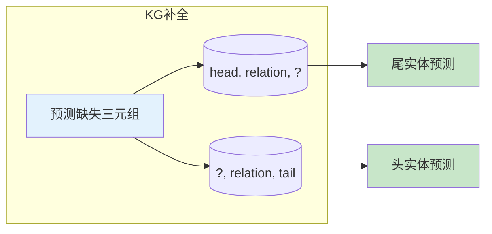
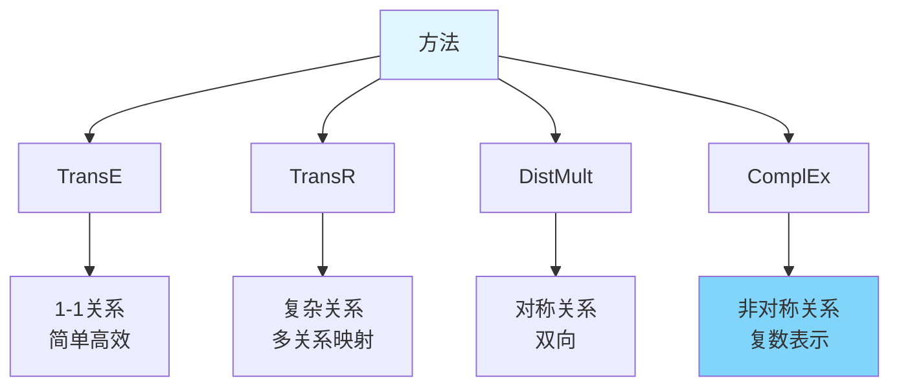

# 图1: 知识图谱补全任务



**说明**: 知识图谱补全预测缺失的实体或关系，补全不完整的知识图谱。

---

# 图2: TransE模型

```mermaid
flowchart LR
    subgraph "TransE假设"
        T1[h + r ≈ t]
    end
    
    T1 --> T2[头实体+关系≈尾实体]
    T2 --> T3[损失函数<br/>d(h+r, t)最小化]
    
    style T1 fill:#e3f2fd
    style T3 fill:#c8e6c9
```

**说明**: TransE将关系建模为头尾实体间的平移向量，简单有效是基础模型。

---

# 图3: TransR模型


**说明**: TransE对所有关系统一处理，TransR将实体映射到不同关系空间处理复杂关系。

---

# 图4: DistMult模型

```mermaid
flowchart LR
    subgraph "DistMult"
        D1[hᵀ diag(r) t]
    end
    
    D1 --> D2[三元组评分]
    D2 --> D3[双线性建模<br/>关系为矩阵]
    
    style D1 fill:#e3f2fd
    style D3 fill:#c8e6c9
```

**说明**: DistMult使用双线性变换，通过对角矩阵建模关系，适合对称关系。

---

# 图5: 知识图谱补全方法对比



**说明**: 不同嵌入方法适合不同类型的关系，选择取决于知识图谱的关系结构。
