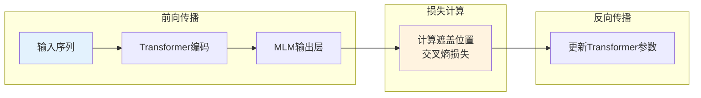
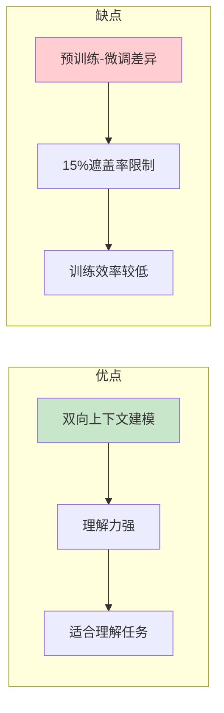
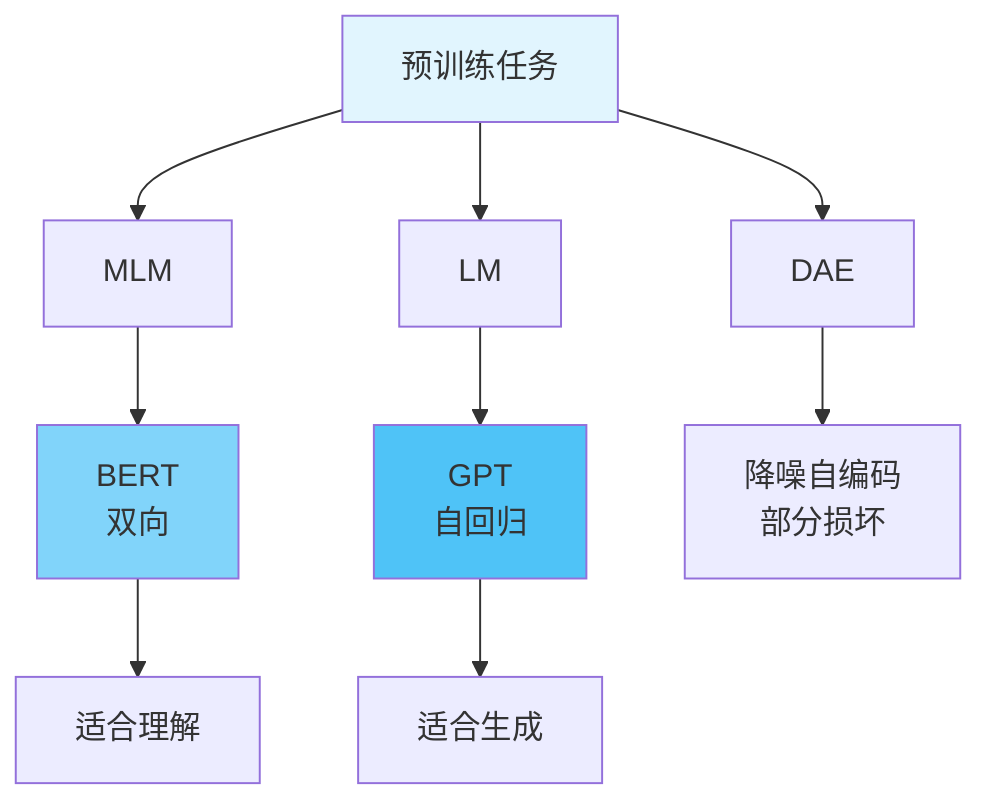

# 图1: MLM任务基本原理

```mermaid
flowchart LR
    subgraph "输入句子"
        I1[The [MASK] ate the fish]
    end
    
    subgraph "MLM任务"
        M1[随机遮盖15%词]
        M1 --> M2[预测遮盖词]
    end
    
    subgraph "训练目标"
        O1[最大化P(cat|I)]
    end
    
    I1 --> M1 --> O1
    
    style I1 fill:#e3f2fd
    style M1 fill:#fff3e0
    style O1 fill:#c8e6c9
```

**说明**: Masked Language Modeling随机遮盖输入中的词，让模型预测被遮盖的词。

---

# 图2: BERT中的MLM实现

```mermaid
flowchart LR
    subgraph "遮盖策略"
        B1[80%: [MASK]标记]
        B2[10%: 随机词替换]
        B3[10%: 保持原词]
    end
    
    B1 --> B4[训练目标]
    B2 --> B4
    B3 --> B4
    B4 --> B5[预测原始词
    
    style B1 fill:#ffcdd2
    style B4 fill:#c8e6c9
```

**说明**: BERT使用改进的MLM策略，80%用[MASK]替换，10%随机替换，10%保持不变，增加鲁棒性。

---

# 图3: MLM训练过程



**说明**: MLM训练时只计算被遮盖位置的损失，通过反向传播更新模型参数。

---

# 图4: MLM的优缺点



**说明**: MLM的双向性是其核心优势，但预训练和微调阶段的不一致是需要注意的问题。

---

# 图5: MLM vs 其他预训练任务



**说明**: MLM与自回归语言建模不同，BERT采用MLM实现双向编码。
