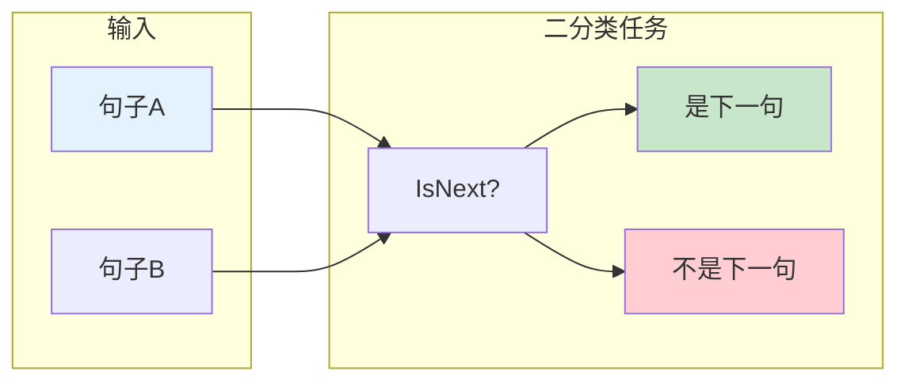
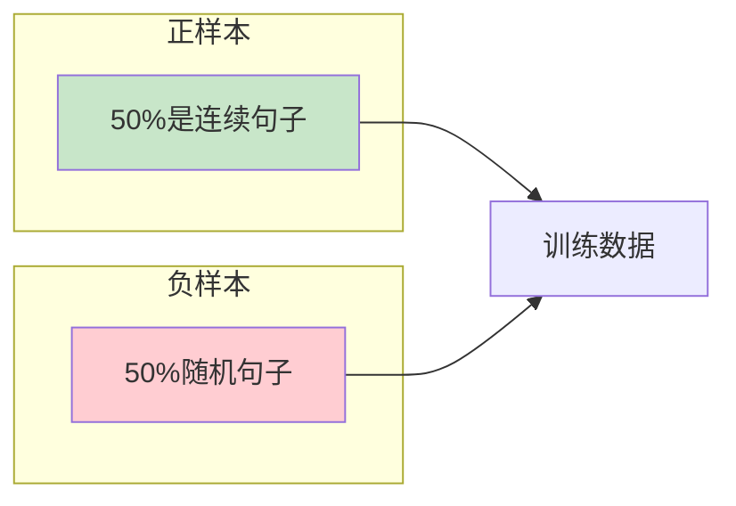
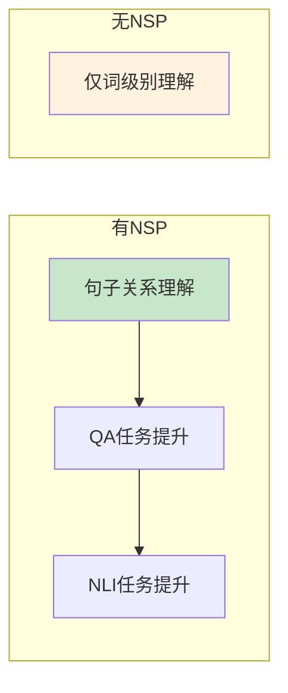
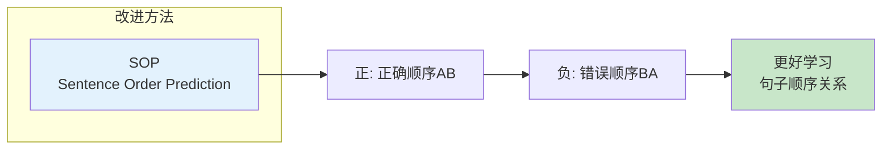

# 图1: NSP任务原理



**说明**: Next Sentence Prediction让模型学习理解句子间的关系，对阅读理解等任务很重要。

---

# 图2: NSP数据构造



**说明**: 训练时50%使用真实的下一句，50%使用随机句子，让模型区分连续性。

---

# 图3: NSPBERT中的位置

在```mermaid
flowchart LR
    subgraph "BERT预训练"
        B1[Token级别<br/>MLM]
        B2[句子级别<br/>NSP]
    end
    
    B1 --> B3[联合训练]
    B2 --> B3
    
    style B1 fill:#e3f2fd
    style B2 fill:#fff3e0
```

**说明**: BERT同时训练MLM和NSP任务，MLM学习词级别表示，NSP学习句子级别表示。

---

# 图4: NSP任务的效果



**说明**: NSP对需要句子级别理解的任务如问答、自然语言推理有显著帮助。

---

# 图5: NSP的后续改进



**说明**: 后来的模型如ALBERT用SOP替代NSP，预测句子顺序而非是否连续，效果更好。
