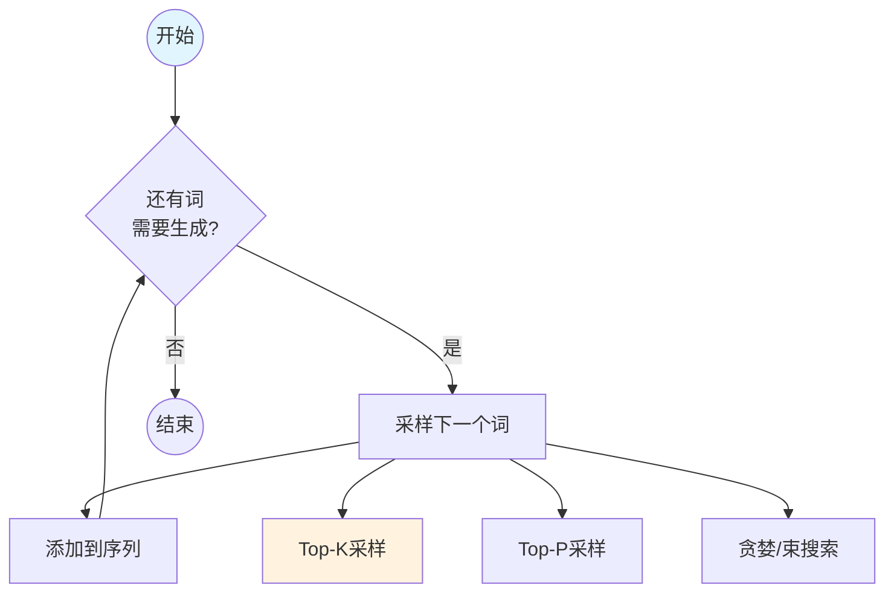
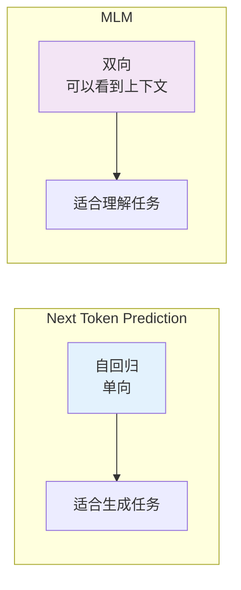
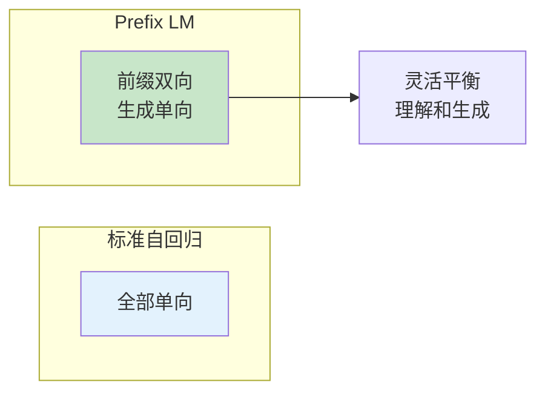

# 图1: Next Token Prediction原理

```mermaid
flowchart LR
    subgraph "输入"
        I1[The]
    end
    
    subgraph "自回归预测"
        P1[P(next|context)]
    end
    
    subgraph "逐词生成"
        G1[The] --> G2[cat] --> G3[ate] --> G4[the] --> G5[fish]
    end
    
    I1 --> P1 --> G1
    
    style I1 fill:#e3f2fd
    style P1 fill:#fff3e0
```

**说明**: 自回归语言模型逐词预测下一个token，基于前面的所有词计算条件概率。

---

# 图2: 训练目标

```mermaid
flowchart LR
    subgraph "最大化似然"
        L1[Σ log P(xᵢ|x<ᵢ;θ)]
    end
    
    subgraph "交叉熵损失"
        L2[L = -Σ x log P(x)]
    end
    
    L1 --> L3[每个位置预测词的计算损失]
    
    style L1 fill:#e3f2fd
    style L3 fill:#c8e6c9
```

**说明**: NTP训练目标是最大化整个序列的似然，等价于最小化交叉熵损失。

---

# 图3: 自回归生成过程



**说明**: 生成时通过不同采样策略平衡多样性和质量，GPT系列使用此范式。

---

# 图4: NTP vs MLM



**说明**: NTP是GPT等模型的核心训练目标，产生强大的文本生成能力。

---

# 图5: Prefix LM变体



**说明**: T5等模型使用Prefix LM，允许部分双向前缀再单向生成。
