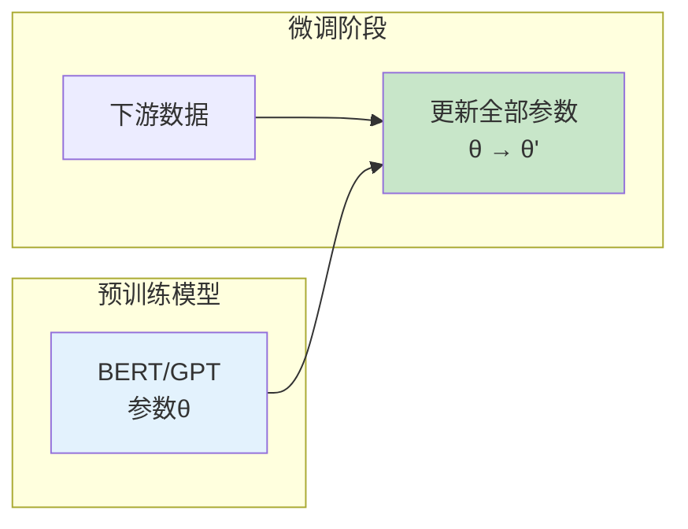
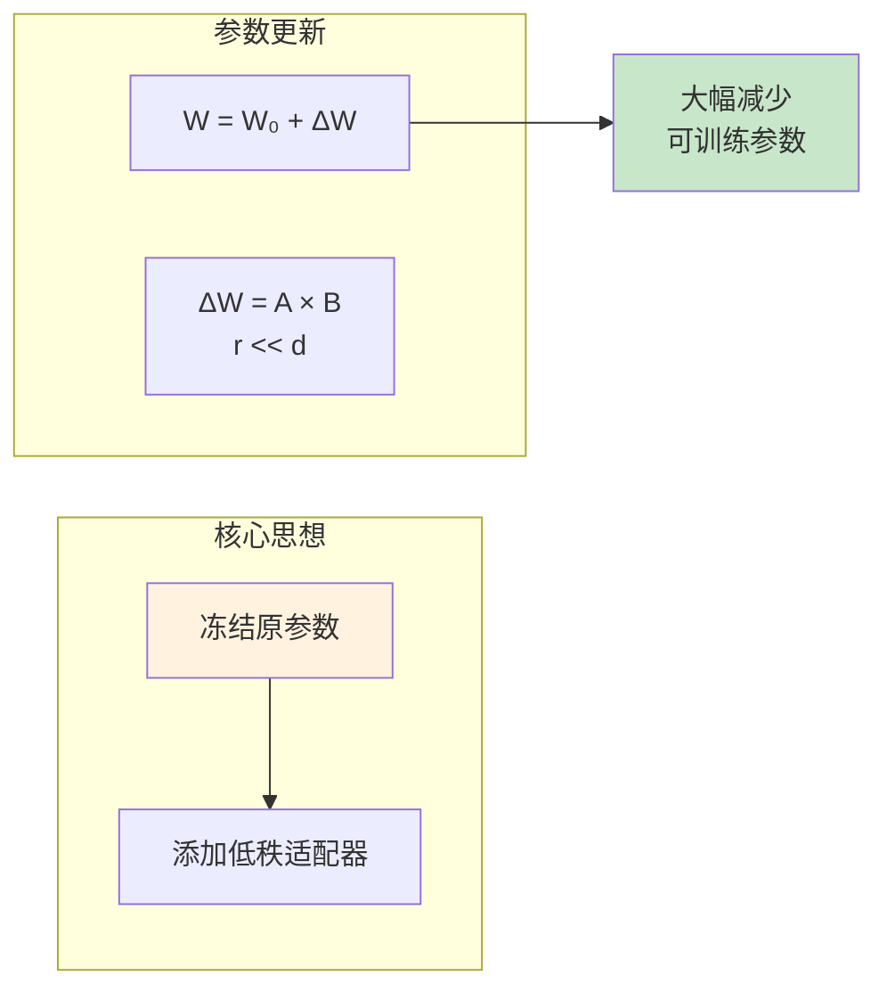
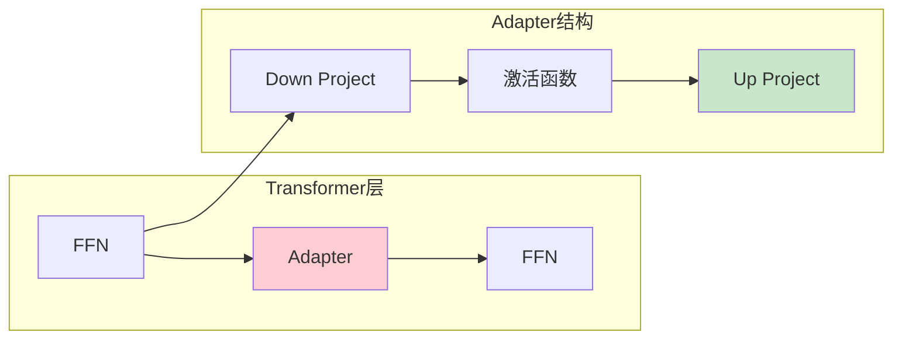
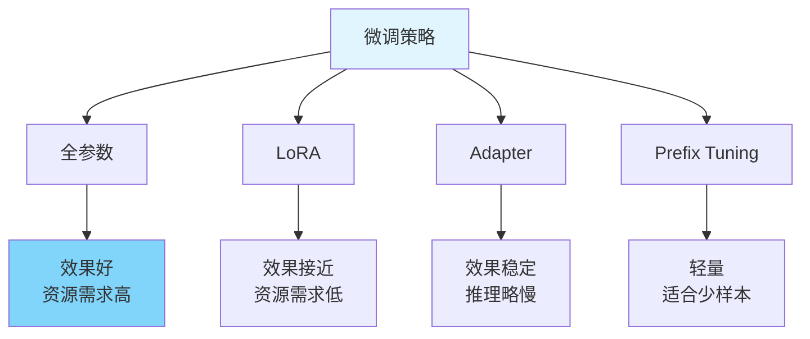

# 图1: 全参数微调



**说明**: 全参数微调使用下游任务数据更新所有模型参数，效果最好但资源消耗大。

---

# 图2: LoRA微调



**说明**: LoRA通过添加低秩矩阵学习参数增量，显著减少可训练参数量和显存需求。

---

# 图3: Adapter微调



**说明**: Adapter在Transformer每层插入小的瓶颈网络，只训练Adapter参数，保持原模型不变。

---

# 图4: 提示微调(Prompt Tuning)

```mermaid
flowchart LR
    subgraph "连续提示"
        P1[可学习向量<br/>[P]₁, [P]₂, ..., [Pₖ]
    end
    
    subgraph "与输入拼接"
        P2[[P][P][P][The][cat]]
    end
    
    P2 --> P3[冻结模型<br/>只训练提示]
    
    style P1 fill:#e3f2fd
    style P3 fill:#c8e6c9
```

**说明**: Prompt Tuning使用可学习的连续提示向量，只需训练少量提示参数。

---

# 图5: 微调策略对比



**说明**: 不同微调策略在效果和效率间权衡，选择取决于任务规模和计算资源。
