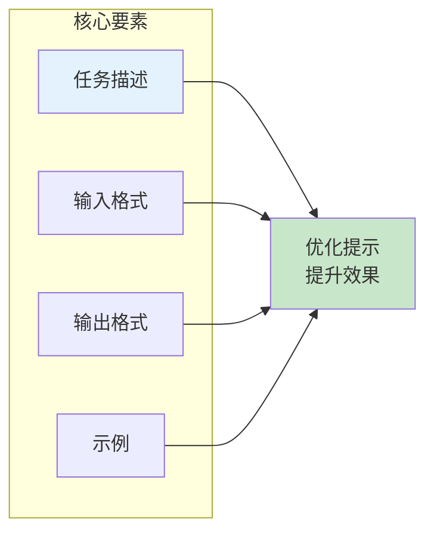
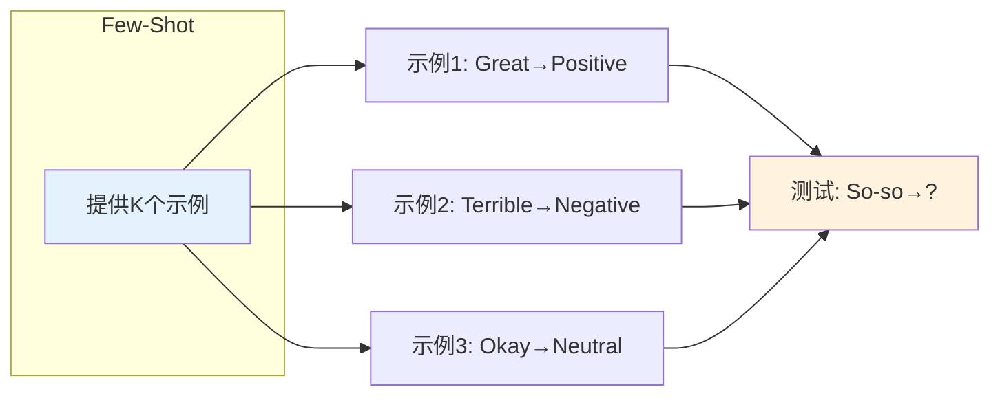
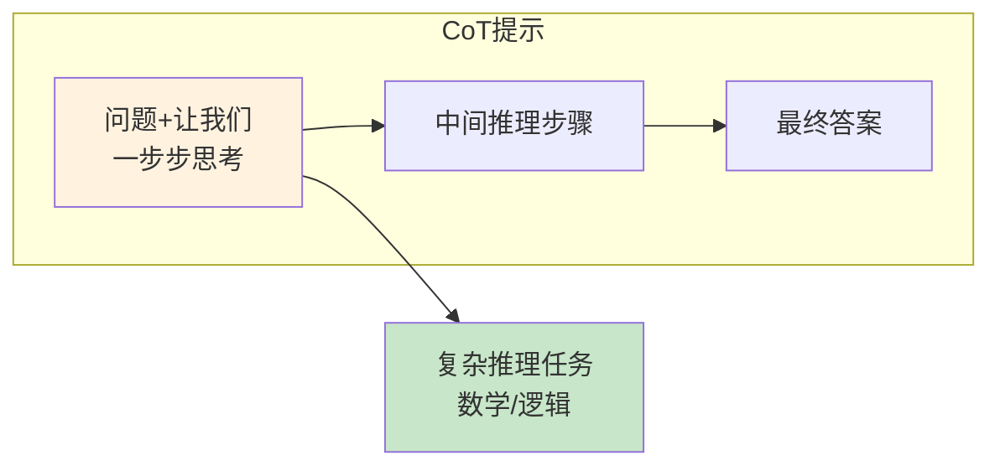
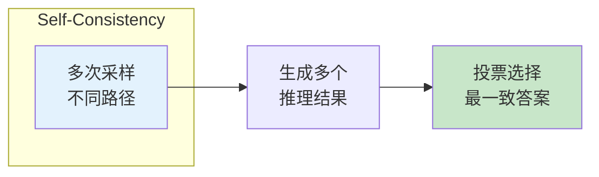
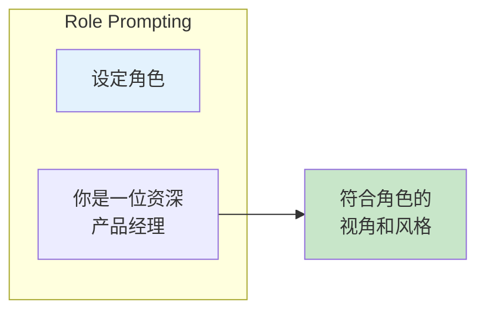
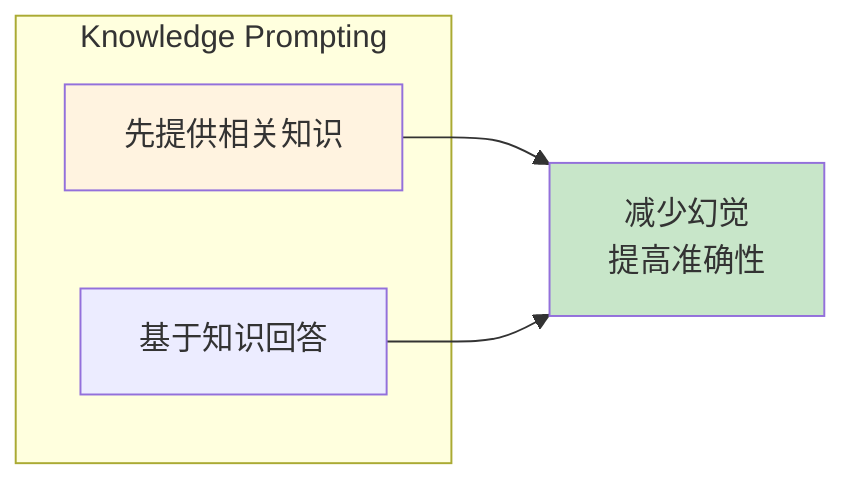
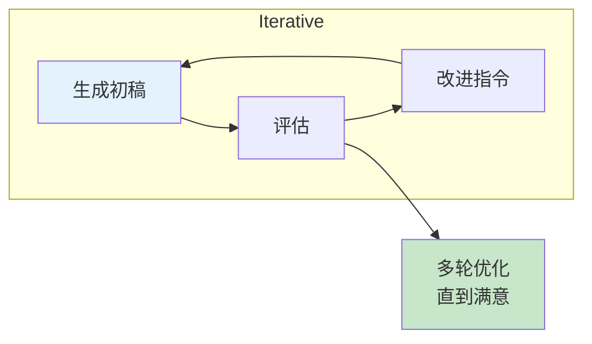
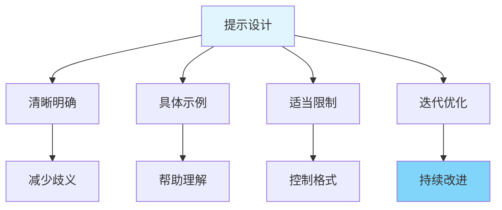

# 图1: 提示工程概述



**说明**: 提示工程通过设计合适的指令、格式和示例，引导模型产生期望的输出。

---

# 图2: 零样本提示

```mermaid
flowchart LR
    subgraph "Zero-Shot"
        Z1[无示例]
        Z1 --> Z2[直接指令]
    end
    
    subgraph "示例"
        Z3[情感分析:<br/>"这个产品很棒"→?]
        Z4[输出: Positive]
    end
    
    Z2 --> Z4
    
    style Z1 fill:#e3f2fd
    style Z4 fill:#c8e6c9
```

**说明**: 零样本提示不提供示例，仅通过指令引导模型完成任务，考验模型泛化能力。

---

# 图3: 少样本提示



**说明**: 少样本提示通过示例帮助模型理解任务格式和意图，提升few-shot性能。

---

# 图4: 思维链提示(CoT)



**说明**: Chain-of-Thought提示引导模型展示推理过程，显著提升复杂推理任务效果。

---

# 图5: 自洽性提示



**说明**: 自洽性通过多路径推理和投票机制，提高推理结果的可靠性。

---

# 图6: 角色提示



**说明**: 角色提示设定模型扮演特定角色，获得更符合特定场景的输出。

---

# 图7: 结构化输出提示

```mermaid
flowchart LR
    subgraph "Output Formatting"
        F1[JSON格式]
        F1 --> F2[{字段1, 字段2}]
    end
    
    F1 --> F3[markdown表格]
    F1 --> F4[列表/编号]
    
    style F1 fill:#e3f2fd
```

**说明**: 指定输出格式便于后续程序解析，提高模型输出可用性。

---

# 图8: 知识提示



**说明**: 在提示中先提供相关背景知识，引导模型基于给定知识而非记忆回答。

---

# 图9: 迭代优化提示



**说明**: 通过迭代方式不断优化提示，基于前轮结果调整指令提高输出质量。

---

# 图10: 提示工程最佳实践



**说明**: 好的提示应清晰具体，包含示例，适当限制输出格式，并持续迭代优化。
