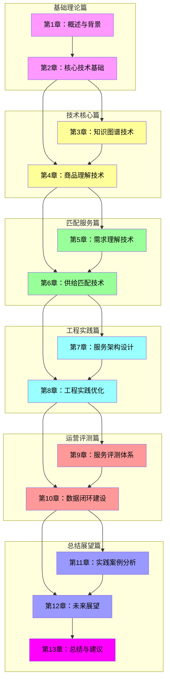

# 图S.2：13章内容关系图

## 章节目录与依赖关系

## 篇章节对应关系

| 篇名 | 章节范围 | 核心目标 |
|------|---------|----------|
| 基础理论篇 | 第1-2章 | 建立知识基础 |
| 技术核心篇 | 第3-4章 | 掌握核心技术 |
| 匹配服务篇 | 第5-6章 | 构建匹配能力 |
| 工程实践篇 | 第7-8章 | 落地工程能力 |
| 运营评测篇 | 第9-10章 | 建立运营体系 |
| 总结展望篇 | 第11-13章 | 总结与展望 |
