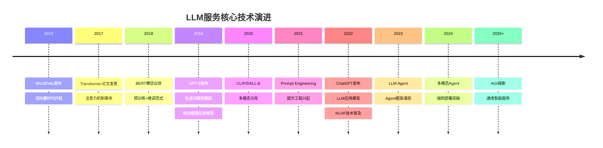
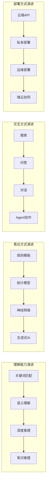

# 图S.3：核心技术演进总览图

## 技术发展时间线

```mermaid
timeline
    title LLM服务核心技术演进
    
    2013 : Word2Vec发布
         : 词向量时代开启
    2017 : Transformer论文发表
         : 注意力机制革命
    2018 : BERT横空出世
         : 预训练+微调范式
    2019 : GPT-2发布
         : 生成式模型崛起
         : 知识图谱应用普及
    2020 : CLIP/DALL-E
         : 多模态元年
    2021 : Prompt Engineering
         : 提示工程兴起
    2022 : ChatGPT发布
         : LLM应用爆发
         : RLHF技术普及
    2023 : LLM Agent
         : Agent框架涌现
    2024 : 多模态Agent
         : 端侧部署突破
    2025+ : AGI探索
         : 通用智能服务
```

## 技术能力演进

```mermaid
flowchart LR
    subgraph 理解能力演进
        A1[关键词匹配] --> A2[语义理解] --> A3[深度推理] --> A4[常识推理]
    end
    
    subgraph 表达方式演进
        B1[规则模板] --> B2[统计模型] --> B3[神经网络] --> B4[生成式AI]
    end
    
    subgraph 交互方式演进
        C1[搜索] --> C2[问答] --> C3[对话] --> C4[Agent协作]
    end
    
    subgraph 部署方式演进
        D1[云端API] --> D2[私有部署] --> D3[边缘部署] --> D4[端云协同]
    end
```
