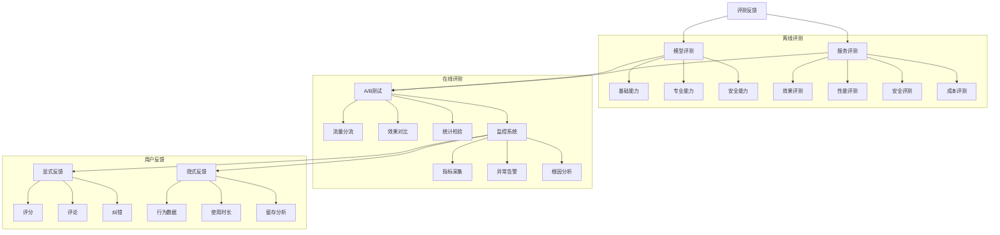
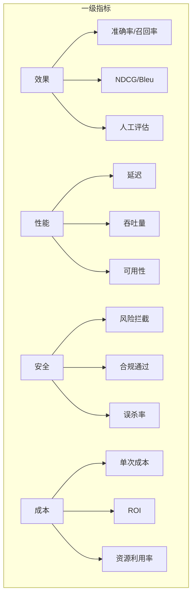

# 图S.4：评测## 全链路体系全景图

评测体系

本书构建了覆盖LLM服务全生命周期的评测体系：

```mermaid
flowchart TD
    subgraph 离线评测
        A[模型评测] --> A1[基础能力]
        A --> A2[专业能力]
        A --> A3[安全能力]
        B[服务评测] --> B1[效果评测]
        B --> B2[性能评测]
        B --> B3[安全评测]
        B --> B4[成本评测]
    end
    
    subgraph 在线评测
        C[A/B测试] --> C1[流量分流]
        C --> C2[效果对比]
        C --> C3[统计检验]
        D[监控系统] --> D1[指标采集]
        D --> D2[异常告警]
        D --> D3[根因分析]
    end
    
    subgraph 用户反馈
        E[显式反馈] --> E1[评分]
        E --> E2[评论]
        E --> E3[纠错]
        F[隐式反馈] --> F1[行为数据]
        F --> F2[使用时长]
        F --> F3[留存分析]
    end
    
    A --> C
    B --> C
    C --> D
    D --> E
    D --> F
    
    G[评测反馈] --> A
    G --> B
```

## 评测指标体系

```mermaid
flowchart TD
    subgraph 一级指标
        A[效果] --> A1[准确率/召回率]
        A --> A2[NDCG/Bleu]
        A --> A3[人工评估]
    end
    
    subgraph 一级指标
        B[性能] --> B1[延迟]
        B --> B2[吞吐量]
        B --> B3[可用性]
    end
    
    subgraph 一级指标
        C[安全] --> C1[风险拦截]
        C --> C2[合规通过]
        C --> C3[误杀率]
    end
    
    subgraph 一级指标
        D[成本] --> D1[单次成本]
        D --> D2[ROI]
        D --> D3[资源利用率]
    end
```
