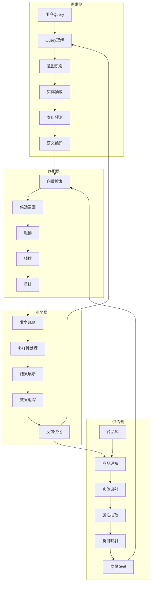
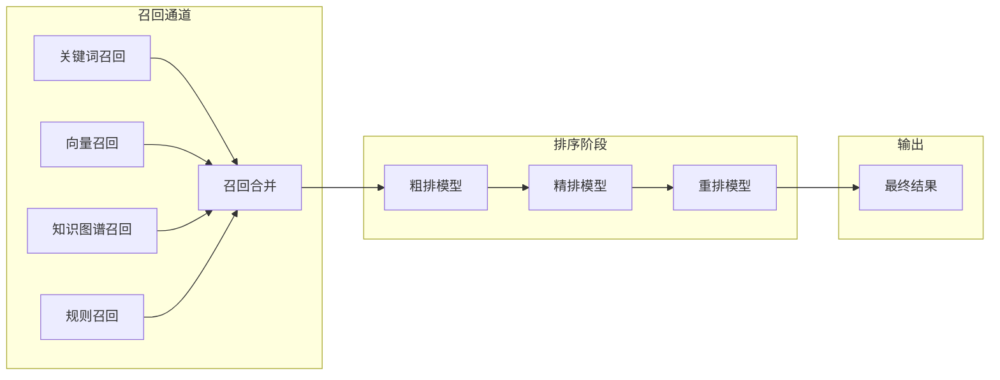

# 图S.5：供需匹配完整流程图

## 端到端匹配Pipeline

本书详细介绍了从用户需求到商品供给的完整匹配流程：

## 多通道召回策略

## 核心算法组件

| 阶段 | 核心组件 | 技术选型 |
|------|---------|----------|
| 需求理解 | 意图识别 | BERT+分类器 |
| 需求理解 | 实体抽取 | BERT+NER |
| 供给理解 | 商品编码 | BERT+属性模型 |
| 匹配召回 | 向量检索 | Faiss/HNSW |
| 排序 | 粗排/精排 | DNN/LightGBM |
| 重排 | 多样性 | MMR/DPP |
