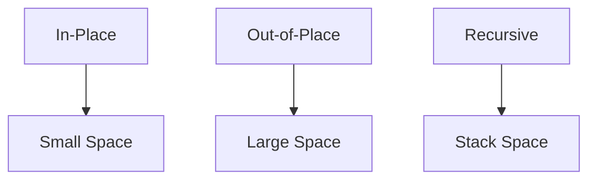
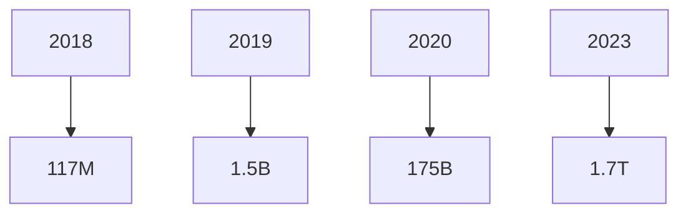
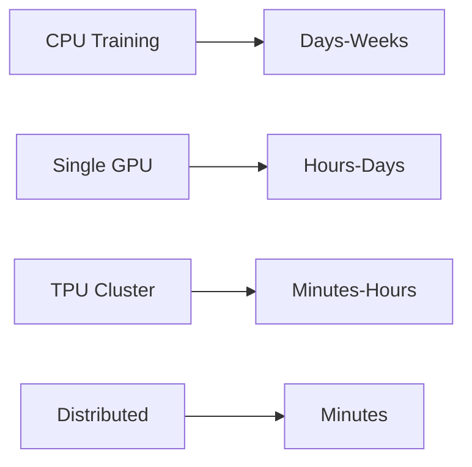
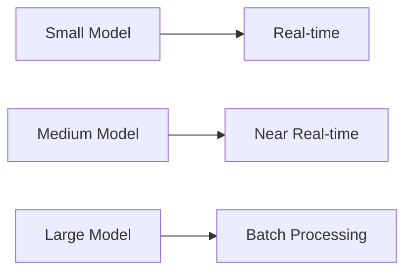
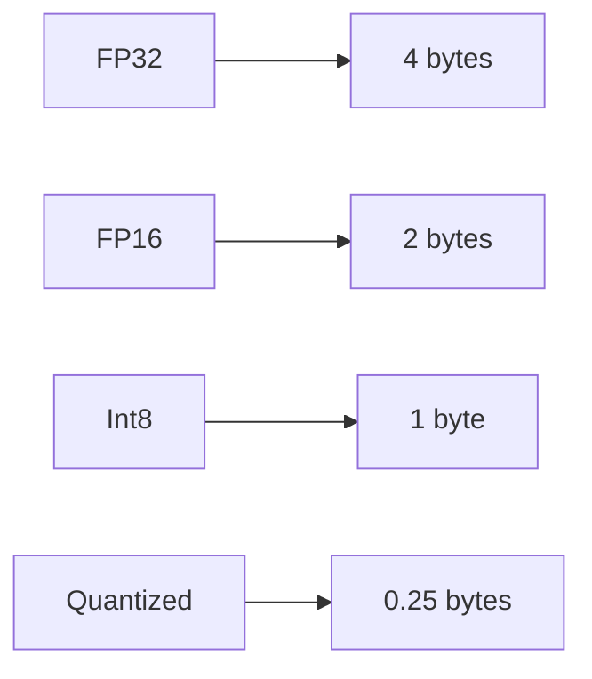
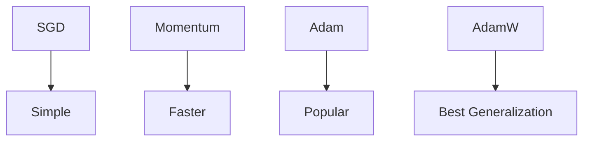

# Supplementary: Algorithm Complexity Comparison

## Diagram 1: Time Complexity Comparison
```mermaid
graph TD
    O1[O(1)] --> Best[Best]
    OlogN[O(log n)] --> Good[Good]
    ON[O(n)] --> Fair[Fair]
    ONlogN[O(n log n)] --> Fair
    ON2[O(n²)] --> Poor[Poor]
    O2N[O(2^n)] --> Worst[Worst]
```

## Diagram 2: Search Algorithms
```mermaid
graph LR
    Linear[Linear Search] --> ON[O(n)]
    Binary[Binary Search] --> OlogN[O(log n)]
    Hash[Hash Table] --> O1[O(1)]
    BST[Binary Search Tree] --> OlogN
```

## Diagram 3: Sorting Algorithms
```mermaid
graph LR
    Bubble[Bubble Sort] --> ON2[O(n²)]
    Quick[Quick Sort] --> ONlogN[O(n log n)]
    Merge[Merge Sort] --> ONlogN
    Heap[Heap Sort] --> ONlogN
    Timsort[Timsort] --> ONlogN
```

## Diagram 4: Space Complexity


## Diagram 5: Neural Network Complexity
```mermaid
graph TD
    FC[Fully Connected] --> ON[O(n×m)]
    Conv[Convolutional] --> Okernel[O(k²×c×f)]
    Attention[Attention] --> Osequence2[O(n²×d)]
```

## Diagram 6: Model Size Trends


## Diagram 7: Training Cost Comparison


## Diagram 8: Inference Latency


## Diagram 9: Memory Requirements


## Diagram 10: Optimization Methods

